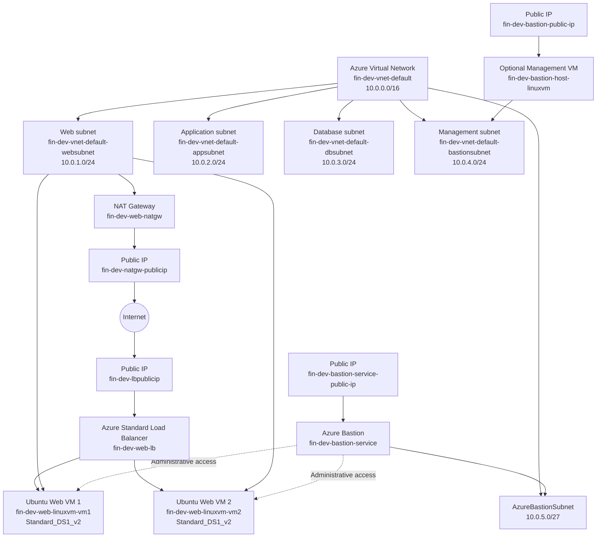
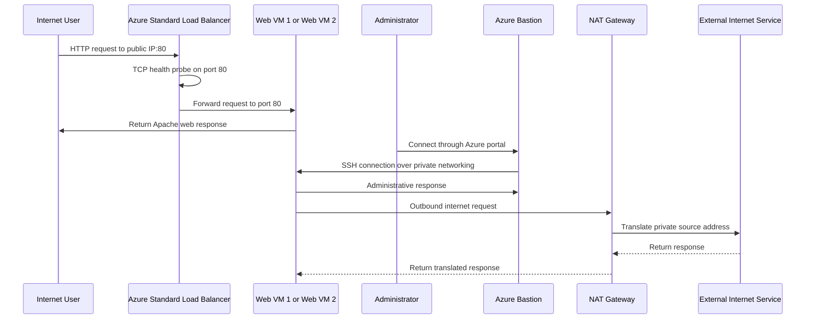

# Linux Linux Virtual Machine (VM) with Load Balancer Project

This project demonstrates how to set up a Linux Virtual Machine (VM) in Microsoft Azure, with a load balancer to distribute incoming traffic across multiple instances for high availability and reliability using Terraform and bash scripts to automate the deployment and configuration process.

The solution provisions a complete networking foundation for a multi-tier application, with dedicated networking segments for web, application, database, and management workloads, ensuring proper isolation and security controls between them. The currently deployed workload consists of multiple linux web serves running Apache HTTP Server behind and Azure Load Balancer, allowing incoming requests to be distributed across heathy backend instances.

The architecture also separates inbound and outbound connectivity: Public application traffic is handled through the load balancer, while outbound internet access from the web tier is provided through an Azure NAT Gateway. Administrative access to the private virtual machines is supported through Azure Bastion and a dedicated Bastion Host instance for secure management, allowing the servers to remain isolated from direct public exposure.

Overall, the project demonstrates how Terraform can be used to build a reusable Azure infrastructure that combines networking, compute, load balancing, secure administration, outbound connectivity, and basic high-availability concepts.

# Architecture solution

In this section we provide a visual representation of the architecture solution, illustrating the various components and their interactions within the Azure environment. The first diagram is done with Mermaid and the second diagram is done using Azure Architecture icons.

**Virtual Network:** `10.0.0.0/16`

| Network Segment        | CIDR Block    | Purpose                                          |
| ---------------------- | ------------- | ------------------------------------------------ |
| **Web Subnet**         | `10.0.1.0/24` | Hosts the public-facing web virtual machines     |
| **Application Subnet** | `10.0.2.0/24` | Reserved for application-tier workloads          |
| **Database Subnet**    | `10.0.3.0/24` | Reserved for database services                   |
| **Management Subnet**  | `10.0.4.0/24` | Used for administrative and management workloads |
| **AzureBastionSubnet** | `10.0.5.0/27` | Dedicated subnet required by Azure Bastion       |

# Data Flow

In this section, we describe the data flow within the architecture, detailing how requests and responses traverse through the various components.

1. A user sends an HTTP request to the public IP address attached to the Azure Load Balancer.
2. The request reaches the frontend configuration named web-lb-publicip-1.
3. The Standard Load Balancer checks backend availability using the TCP health probe named tcp-probe.
4. The health probe tests port 80 on the backend web VMs.
5. If a VM is healthy, the load balancer forwards the request to port 80.
6. The request is sent to one of the following backend instances:
   - `fin-dev-web-linuxvm-vm1`
   - `fin-dev-web-linuxvm-vm2`
7. Apache returns the static web content installed by `ubuntu-webvm-script.sh`.
8. The response travels back through the load balancer to the client.

## Components of the Solution

The environment is composed of several Azure services that work together to provide networking, compute, traffic distribution, secure administration, and outbound connectivity.

| Component                      | Purpose                                                                                                                                            |
| ------------------------------ | -------------------------------------------------------------------------------------------------------------------------------------------------- |
| **Azure Virtual Network**      | Provides the private network boundary for the environment and connects the different application tiers.                                            |
| **Web Subnet**                 | Hosts the Linux web servers that serve the application.                                                                                            |
| **Application Subnet**         | Reserved for future application-tier workloads and internal services.                                                                              |
| **Database Subnet**            | Reserved for future database services and backend data workloads.                                                                                  |
| **Management Subnet**          | Provides a dedicated network segment for administrative and management resources.                                                                  |
| **AzureBastionSubnet**         | Dedicated subnet required by the Azure Bastion managed service.                                                                                    |
| **Linux Virtual Machines**     | Run the Apache web server and host the sample web application. Multiple instances are deployed to demonstrate redundancy and load balancing.       |
| **Azure Load Balancer**        | Provides the public entry point for the application and distributes incoming traffic across the available web virtual machines.                    |
| **Load Balancer Health Probe** | Continuously checks the availability of the backend web servers so that traffic is sent only to healthy instances.                                 |
| **Azure NAT Gateway**          | Provides centralized outbound internet connectivity for the web subnet without assigning public IP addresses directly to the web virtual machines. |
| **Public IP Addresses**        | Provide external connectivity for services such as the Load Balancer, NAT Gateway, and Azure Bastion.                                              |
| **Network Security Groups**    | Control inbound and outbound network traffic for the different subnets using protocol, port, source, destination, and priority rules.              |
| **Azure Bastion**              | Provides secure administrative access to private virtual machines without requiring direct public IP addresses on the workload servers.            |
| **Optional Management VM**     | Can be used as an additional administrative or troubleshooting host inside the management network.                                                 |

### Component Interaction

At a high level, incoming web traffic reaches the **Azure Load Balancer**, which distributes requests across the Linux web servers. The **health probe** verifies that backend instances are available before they receive traffic.

The web virtual machines use the **NAT Gateway** for outbound internet access, while administrative access is provided through **Azure Bastion** over the private network or an optional management virtual machine. **Network Security Groups** provide traffic filtering between the different network segments.

The application and database subnets are currently reserved for future workloads, allowing the environment to evolve into a complete multi-tier architecture without redesigning the underlying network.

# Conclusion

Project `00-Project01-LinuxVM` establishes a foundational Azure web application architecture using Terraform.

The solution provides two Ubuntu 22.04 Linux web servers in the 10.0.1.0/24 web subnet. An Azure Load Balancer exposes the application through the public IP and distributes TCP port `80` traffic across both web VMs.

The broader `10.0.0.0/16` virtual network is divided into dedicated web, application, database, management, and Azure Bastion subnets. This creates a logical foundation for expanding the project into a complete multi-tier application.

The current project is primarily a web-tier and networking demonstration. The application and database subnets are provisioned as architectural placeholders for future services, but they do not currently contain application servers or database resources.
