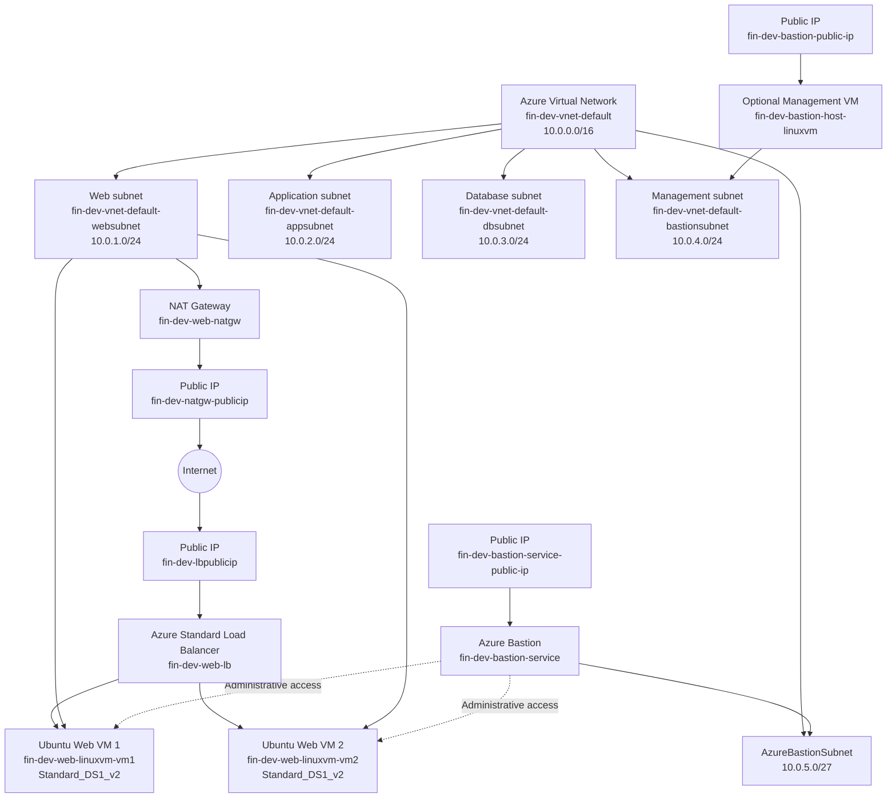
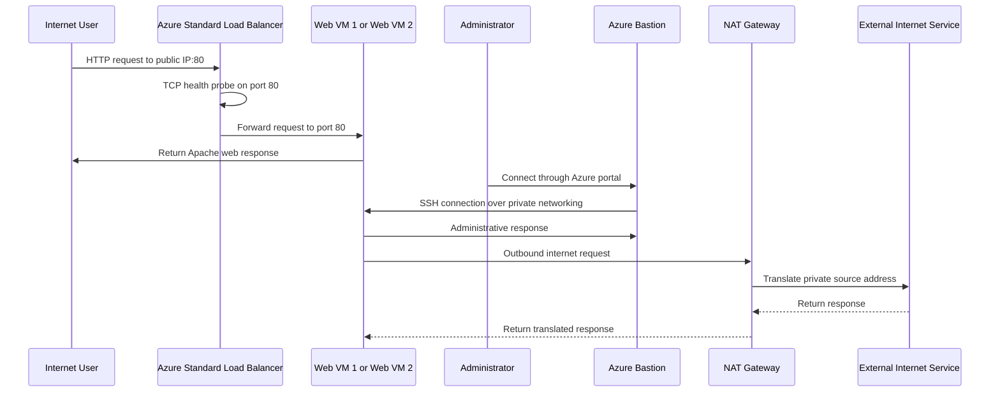

# Linux Linux Virtual Machine (VM) with Load Balancer Project

This project demonstrates how to set up a Linux Virtual Machine (VM) in Microsoft Azure, with a load balancer to distribute incoming traffic across multiple instances for high availability and reliability using Terraform and bash scripts to automate the deployment and configuration process.

The solution provisions a complete networking foundation for a multi-tier application, with dedicated networking segments for web, application, database, and management workloads, ensuring proper isolation and security controls between them. The currently deployed workload consists of multiple linux web serves running Apache HTTP Server behind and Azure Load Balancer, allowing incoming requests to be distributed across heathy backend instances.

The architecture also separates inbound and outbound connectivity: Public application traffic is handled through the load balancer, while outbound internet access from the web tier is provided through an Azure NAT Gateway. Administrative access to the private virtual machines is supported through Azure Bastion and a dedicated Bastion Host instance for secure management, allowing the servers to remain isolated from direct public exposure.

Overall, the project demonstrates how Terraform can be used to build a reusable Azure infrastructure that combines networking, compute, load balancing, secure administration, outbound connectivity, and basic high-availability concepts.

# Architecture solution

In this section we provide a visual representation of the architecture solution, illustrating the various components and their interactions within the Azure environment. The first diagram is done with Mermaid and the second diagram is done using Azure Architecture icons.

**Virtual Network:** `10.0.0.0/16`

| Network Segment        | CIDR Block    | Purpose                                          |
| ---------------------- | ------------- | ------------------------------------------------ |
| **Web Subnet**         | `10.0.1.0/24` | Hosts the public-facing web virtual machines     |
| **Application Subnet** | `10.0.2.0/24` | Reserved for application-tier workloads          |
| **Database Subnet**    | `10.0.3.0/24` | Reserved for database services                   |
| **Management Subnet**  | `10.0.4.0/24` | Used for administrative and management workloads |
| **AzureBastionSubnet** | `10.0.5.0/27` | Dedicated subnet required by Azure Bastion       |

# Data Flow

In this section, we describe the data flow within the architecture, detailing how requests and responses traverse through the various components.

1. A user sends an HTTP request to the public IP address attached to the Azure Load Balancer.
2. The request reaches the frontend configuration named web-lb-publicip-1.
3. The Standard Load Balancer checks backend availability using the TCP health probe named tcp-probe.
4. The health probe tests port 80 on the backend web VMs.
5. If a VM is healthy, the load balancer forwards the request to port 80.
6. The request is sent to one of the following backend instances:
   - `fin-dev-web-linuxvm-vm1`
   - `fin-dev-web-linuxvm-vm2`
7. Apache returns the static web content installed by `ubuntu-webvm-script.sh`.
8. The response travels back through the load balancer to the client.
