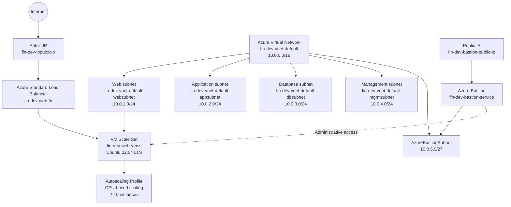
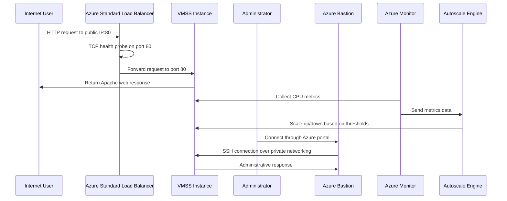

# Web Virtual Machine Scale Set (VMSS) with Load Balancer and Auto-scaling Project

This project demonstrates how to set up a Virtual Machine Scale Set (VMSS) in Microsoft Azure with automatic scaling capabilities, using a load balancer to distribute incoming traffic across multiple instances for high availability and reliability. Terraform and bash scripts automate the deployment and configuration process.

The solution provisions a complete networking foundation with dedicated networking segments for web and application workloads. The deployed workload consists of multiple Linux virtual machines managed through a Virtual Machine Scale Set running Apache HTTP Server behind an Azure Load Balancer, allowing incoming requests to be distributed across healthy backend instances with automatic scaling based on demand.

The architecture provides flexible scaling policies that automatically adjust the number of running instances based on CPU metrics, ensuring cost efficiency during low-traffic periods and maintaining performance during peak loads. Administrative access to the private virtual machines is supported through Azure Bastion for secure management, allowing the servers to remain isolated from direct public exposure.

Overall, the project demonstrates how Terraform can be used to build a scalable Azure infrastructure that combines networking, compute, load balancing, automatic scaling, and secure administration concepts.

# Architecture solution

In this section we provide a visual representation of the architecture solution, illustrating the various components and their interactions within the Azure environment. The first diagram is done with Mermaid and the second diagram is done using Azure Architecture icons.

**Virtual Network:** `10.0.0.0/16`

| Network Segment        | CIDR Block    | Purpose                                          |
| ---------------------- | ------------- | ------------------------------------------------ |
| **Web Subnet**         | `10.0.1.0/24` | Hosts the web virtual machine scale set          |
| **Application Subnet** | `10.0.2.0/24` | Reserved for application-tier workloads          |
| **Database Subnet**    | `10.0.3.0/24` | Reserved for database services                   |
| **Management Subnet**  | `10.0.4.0/24` | Used for administrative and management workloads |
| **AzureBastionSubnet** | `10.0.5.0/27` | Dedicated subnet required by Azure Bastion       |

# Data Flow

In this section, we describe the data flow within the architecture, detailing how requests and responses traverse through the various components.

1. A user sends an HTTP request to the public IP address attached to the Azure Load Balancer.
2. The request reaches the frontend configuration of the load balancer.
3. The Standard Load Balancer checks backend availability using the TCP health probe on port 80.
4. The health probe tests each instance in the VMSS backend pool.
5. If an instance is healthy, the load balancer forwards the request to port 80.
6. The request is sent to one of the available instances in the Virtual Machine Scale Set.
7. Apache returns the static web content installed by the custom script extension.
8. The response travels back through the load balancer to the client.
9. Azure Monitor continuously collects CPU utilization metrics from the VMSS instances.
10. The autoscaling engine evaluates metrics against configured thresholds and scales the number of instances up or down.
11. Administrators can securely connect to any instance through Azure Bastion over the private network.

## Components of the Solution

The environment is composed of several Azure services that work together to provide networking, compute, traffic distribution, automatic scaling, and secure administration.

| Component                      | Purpose                                                                                                                                            |
| ------------------------------ | -------------------------------------------------------------------------------------------------------------------------------------------------- |
| **Azure Virtual Network**      | Provides the private network boundary for the environment and connects the different application tiers.                                            |
| **Web Subnet**                 | Hosts the Virtual Machine Scale Set that serves the application.                                                                                   |
| **Application Subnet**         | Reserved for future application-tier workloads and internal services.                                                                              |
| **Database Subnet**            | Reserved for future database services and backend data workloads.                                                                                  |
| **Management Subnet**          | Provides a dedicated network segment for administrative and management resources.                                                                  |
| **AzureBastionSubnet**         | Dedicated subnet required by the Azure Bastion managed service.                                                                                    |
| **Virtual Machine Scale Set**  | Manages a collection of identical Linux virtual machines running Apache web server. Instances are created and destroyed based on scaling policies. |
| **Azure Load Balancer**        | Provides the public entry point for the application and distributes incoming traffic across the available VMSS instances.                          |
| **Load Balancer Health Probe** | Continuously checks the availability of the backend VMSS instances so that traffic is sent only to healthy backends.                               |
| **Autoscaling Profile**        | Defines scaling rules based on CPU utilization metrics, automatically adjusting the number of running instances.                                   |
| **Azure Monitor**              | Collects performance metrics from VMSS instances and provides data to the autoscaling engine for informed scaling decisions.                       |
| **Public IP Addresses**        | Provide external connectivity for services such as the Load Balancer and Azure Bastion.                                                            |
| **Network Security Groups**    | Control inbound and outbound network traffic for the different subnets using protocol, port, source, destination, and priority rules.              |
| **Azure Bastion**              | Provides secure administrative access to private virtual machines without requiring direct public IP addresses on the workload servers.            |
| **Custom Script Extension**    | Executes initialization scripts on VMSS instances to install and configure Apache web server and application content.                              |

### Component Interaction

At a high level, incoming web traffic reaches the **Azure Load Balancer**, which distributes requests across the instances in the **Virtual Machine Scale Set**. The **health probe** verifies that backend instances are available before they receive traffic.

The **Autoscaling Profile** continuously monitors CPU metrics through **Azure Monitor**. When CPU utilization exceeds configured thresholds, the autoscale engine automatically increases the number of VMSS instances. When demand decreases below lower thresholds, the engine scales down to reduce costs.

Administrative access is provided through **Azure Bastion** over the private network, enabling secure management of VMSS instances. **Network Security Groups** provide traffic filtering between the different network segments.

The application and database subnets are currently reserved for future workloads, allowing the environment to evolve into a complete multi-tier architecture without redesigning the underlying network.

# Conclusion

Project `01-Project02-WebVMSS` extends the foundational Azure web application architecture from Project 01 by introducing automatic scaling capabilities through a Virtual Machine Scale Set.

The solution manages a collection of Ubuntu 22.04 Linux web servers in the 10.0.1.0/24 web subnet through a VMSS. An Azure Load Balancer exposes the application through the public IP and distributes TCP port `80` traffic across all healthy VMSS instances.

The broader `10.0.0.0/16` virtual network is divided into dedicated web, application, database, management, and Azure Bastion subnets. The VMSS is configured with autoscaling profiles that dynamically adjust the number of running instances between 2 and 10 based on CPU utilization metrics.

This project demonstrates a production-ready approach to scaling web applications on Azure, combining the networking foundation from Project 01 with infrastructure elasticity through VMSS and intelligent autoscaling policies. The application and database subnets remain provisioned as architectural placeholders for future services and expansion of the solution into a complete multi-tier application.
