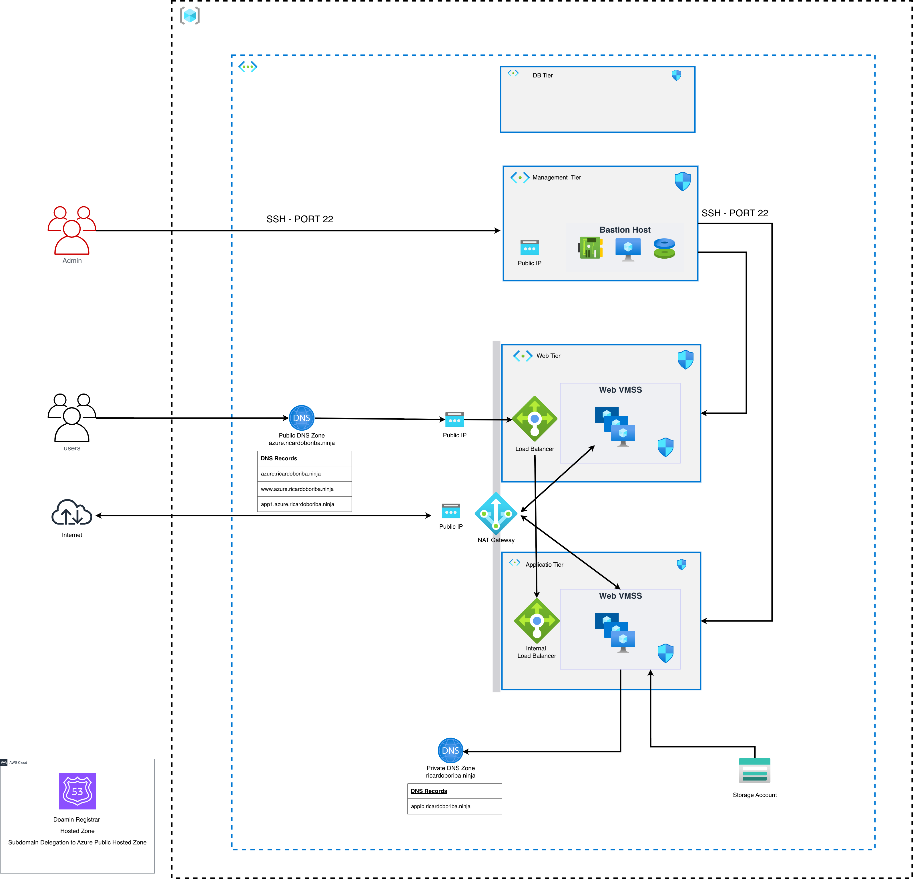
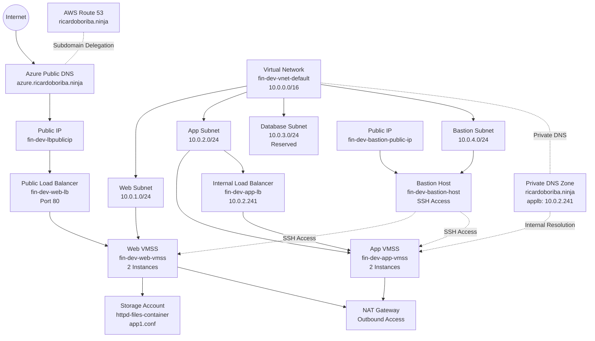
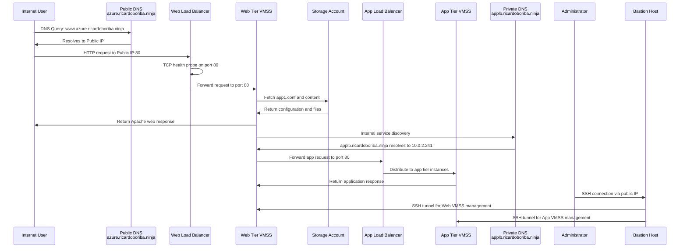

# Multi-Tier VMSS Architecture with Dual Load Balancers, Storage, and DNS Delegation

This project implements a production-ready, multi-tier web application architecture in Microsoft Azure featuring two Virtual Machine Scale Sets (VMSS) with independent load balancers, cloud-native storage integration, and hybrid DNS configuration spanning Azure and AWS. Terraform and bash scripts automate the complete deployment and configuration workflow.

The solution provisions a comprehensive networking foundation with dedicated subnets for web, application, database, and management workloads. The architecture deploys:

- **Web Tier VMSS**: Ubuntu 22.04 instances running Apache HTTP Server behind a public-facing Azure Load Balancer, exposed to the internet via DNS and public IP address
- **Application Tier VMSS**: Ubuntu 22.04 instances behind an internal Azure Load Balancer accessible only within the virtual network via private DNS
- **Cloud Storage**: Azure Storage Account with container-based configuration file distribution and static website hosting capability
- **Hybrid DNS**: Private DNS zone for internal service discovery and public DNS zone with subdomain delegation from AWS Route 53 to Azure nameservers
- **Secure Administration**: NAT Gateway for outbound internet access and Bastion Host for secure SSH access to private instances

The architecture demonstrates how Terraform orchestrates a complete multi-tier application infrastructure combining networking, compute scaling, load balancing, cloud storage, hybrid DNS management, and secure administrative access patterns.

# Architecture solution

In this section we provide a visual representation of the architecture solution, illustrating the various components and their interactions within the Azure environment. One of the diagrams is done with Mermaid and the other diagram is done using Azure Architecture icons.

**Virtual Network:** `10.0.0.0/16`

| Network Segment        | CIDR Block    | Purpose                                                          |
| ---------------------- | ------------- | ---------------------------------------------------------------- |
| **Web Subnet**         | `10.0.1.0/24` | Hosts the Web Tier VMSS instances and public load balancer       |
| **Application Subnet** | `10.0.2.0/24` | Hosts the App Tier VMSS and internal load balancer (10.0.2.241)  |
| **Database Subnet**    | `10.0.3.0/24` | Reserved for future database services and backend data workloads |
| **Bastion Subnet**     | `10.0.4.0/24` | Hosts Bastion Host for secure administrative SSH access          |
| **AzureBastionSubnet** | `10.0.5.0/27` | Reserved for future Azure Bastion service deployment             |

# Data Flow

In this section, we describe the traffic flow and interactions across the multi-tier architecture, detailing how internet requests, internal service communication, and administrative access traverse the various components.

**Public-Facing Traffic Flow:**

1. Internet users query public DNS `azure.ricardoboriba.ninja` hosted in Azure DNS (subdomain delegated from AWS Route 53)
2. DNS resolves to the public IP address of the Web Load Balancer
3. HTTP requests (port 80) reach the public load balancer's frontend configuration
4. The load balancer performs TCP health probes on port 80 to verify Web VMSS instance health
5. Healthy instances receive traffic and run Apache HTTP Server (2-instance VMSS)
6. Web instances fetch configuration and content files from the Storage Account container
7. Apache returns responses back through the load balancer to clients

**Internal Application Communication:**

8. Web tier instances resolve internal service names via private DNS (applb.ricardoboriba.ninja → 10.0.2.241)
9. Cross-tier requests are forwarded to the Application Load Balancer (internal, 10.0.2.241)
10. The internal load balancer distributes requests to the App VMSS instances in the application subnet
11. Application tier processes requests and returns responses through the internal load balancer

**Administrative Access:**

12. Administrators connect securely to the Bastion Host via public IP and SSH
13. Bastion Host tunnels SSH connections to the Web VMSS instances in the private Web Subnet
14. Bastion Host tunnels SSH connections to the App VMSS instances in the private App Subnet
15. Management traffic flows through the private network only; workload VMs remain unexposed to the internet

**Outbound Internet Access:**

- Both Web and App subnets use the NAT Gateway for outbound internet access (e.g., package updates, external API calls)
- All outbound traffic originate from the NAT Gateway's public IP address

## Components of the Solution

The environment comprises multiple integrated Azure services and cross-cloud DNS configuration to deliver a production-ready multi-tier application architecture.

| Component                         | Purpose                                                                                                                                                      |
| --------------------------------- | ------------------------------------------------------------------------------------------------------------------------------------------------------------ |
| **Azure Virtual Network (VNet)**  | `10.0.0.0/16` — Provides isolated private network boundary and routes traffic between application tiers.                                                     |
| **Web Subnet**                    | `10.0.1.0/24` — Hosts Web Tier VMSS instances (2 instances); connected to public load balancer and NAT Gateway for outbound access.                          |
| **Application Subnet**            | `10.0.2.0/24` — Hosts App Tier VMSS instances (2 instances); connected to internal load balancer; isolated from public internet.                             |
| **Database Subnet**               | `10.0.3.0/24` — Reserved for future database services and backend data workloads with inbound rules for MySQL, SQL Server, PostgreSQL.                       |
| **Bastion Subnet**                | `10.0.4.0/24` — Hosts Bastion Host VM for secure SSH/RDP administrative access to private VMSS instances.                                                    |
| **AzureBastionSubnet**            | `10.0.5.0/27` — Reserved for future Azure Bastion managed service deployment.                                                                                |
| **Web Tier VMSS**                 | `fin-dev-web-vmss` — Manages 2 Ubuntu 22.04 LTS instances running Apache HTTP Server; instances scale based on load; connected to public load balancer.      |
| **Application Tier VMSS**         | `fin-dev-app-vmss` — Manages 2 Ubuntu 22.04 LTS instances; receives requests from web tier via internal load balancer; never exposed to public internet.     |
| **Public Load Balancer**          | `fin-dev-web-lb` — Standard SKU; distributes incoming HTTP (port 80) traffic across Web VMSS; health probe validates instance availability.                  |
| **Internal Load Balancer**        | `fin-dev-app-lb` — Standard SKU; private IP `10.0.2.241`; distributes cross-tier requests across App VMSS; private DNS name: `applb`.                        |
| **Load Balancer Health Probe**    | TCP probe on port 80; continuously checks instance availability; only healthy instances receive traffic.                                                     |
| **Public IP Addresses**           | `fin-dev-lbpublicip` (web LB), `fin-dev-natgw-publicip` (NAT), `fin-dev-bastion-public-ip` (Bastion Host) — Enable external connectivity and DNS resolution. |
| **NAT Gateway**                   | Provides outbound internet access for Web and App subnets; all outbound traffic masquerades as the NAT Gateway public IP.                                    |
| **Storage Account**               | Cloud-native storage for configuration files (app1.conf) and static website content; accessed by Web VMSS via storage account credentials.                   |
| **Storage Container**             | `httpd-files-container` — Private blob container holding Apache configuration files distributed to Web VMSS instances at deployment.                         |
| **Network Security Groups (NSG)** | Control inbound/outbound traffic per subnet; Web/App NSGs allow ports 80, 443, 22; Database NSG allows MySQL/SQL/PostgreSQL; Bastion NSG allows SSH/RDP.     |
| **Private DNS Zone**              | `ricardoboriba.ninja` — Internal service discovery; A record `applb` resolves to internal load balancer IP (10.0.2.241) for cross-tier communication.        |
| **Public DNS Zone**               | `azure.ricardoboriba.ninja` — Azure-hosted subdomain; delegated from AWS Route 53 parent zone; A records (@, www, app1) point to web LB public IP.           |
| **AWS Route 53 Delegation**       | Parent zone `ricardoboriba.ninja` (AWS) delegates `azure.ricardoboriba.ninja` (Azure) via NS record pointing to Azure nameservers.                           |
| **Bastion Host**                  | `fin-dev-bastion-host-linuxvm` — Ubuntu 22.04; public IP for admin access; provides SSH tunneling to private Web and App VMSS instances.                     |
| **Autoscaling Profile**           | CPU-based scaling rules (commented in template); allows adjustment of instance count based on Azure Monitor metrics when uncommented.                        |
| **Azure Monitor**                 | Collects performance metrics (CPU, memory) from VMSS and load balancer; feeds data to autoscaling engine for informed scaling decisions.                     |

### Component Interaction

**Public-Facing Traffic Path:**
Internet traffic enters through the **Public DNS Zone** (`azure.ricardoboriba.ninja`), which is delegated from AWS Route 53. The DNS A records resolve to the **Public Load Balancer** public IP. The load balancer's **health probe** continuously validates **Web VMSS** instance availability, forwarding HTTP requests only to healthy backends running Apache.

**Cross-Tier Internal Communication:**
Web tier instances discover the **Application Load Balancer** via the **Private DNS Zone** (applb.ricardoboriba.ninja → 10.0.2.241). Requests are routed to the internal load balancer, which distributes traffic to **App VMSS** instances in the private Application Subnet. This internal-only path ensures the application tier is never exposed to the internet.

**Storage Integration:**
Both VMSS tiers access the **Storage Account** using credentials injected at deployment time. The **Storage Container** holds configuration files (app1.conf) that are fetched and applied during instance startup via the custom data scripts.

**Outbound Connectivity:**
Both Web and App subnets route outbound traffic through the **NAT Gateway**, masquerading all external requests as originating from the NAT's public IP. This allows instances to retrieve package updates, call external APIs, and access internet services without direct public IP addresses.

**Administrative Access:**
The **Bastion Host** (in the Bastion Subnet) provides secure SSH access to administrators via a public IP. The Bastion tunnels SSH sessions to private VMSS instances in both Web and App subnets, enabling secure management without exposing workload VMs to the internet.

**Monitoring and Scaling:**
The **Autoscaling Profile** (currently commented) continuously monitors CPU and memory metrics through **Azure Monitor**. When thresholds are exceeded, the autoscaling engine automatically adjusts the number of instances in each VMSS, balancing performance and cost.

**Network Isolation:**
**Network Security Groups** enforce least-privilege access:

- Web Subnet NSG: Allows ports 80 (HTTP), 443 (HTTPS), 22 (SSH)
- App Subnet NSG: Allows ports 80, 443, 8080 (app), 22 (SSH)
- Database Subnet NSG: Allows database ports (3306, 1433, 5432) for future services
- Bastion Subnet NSG: Allows SSH (22) and RDP (3389) for administrative access

**Future Extensibility:**
The Database and reserved subnets provide architectural placeholders for expanding the solution into a complete three-tier application stack (web, business logic, data) without redesigning the network foundation.

# Conclusion

Project `01-Project02-WebVMSS` demonstrates a production-grade, multi-tier Azure application architecture that significantly extends the foundational concepts from [Project 01](../00-Project01-LinuxVM/README.md).

**Architecture Highlights:**

- **Dual VMSS Deployment**: Separate Web Tier (public-facing) and Application Tier (internal) with independent scaling policies, enabling true three-tier architecture patterns
- **Dual Load Balancers**: Public load balancer for internet-facing traffic and internal load balancer for cross-tier communication, enforcing network segmentation and security
- **Hybrid DNS Configuration**: Private DNS zone for internal service discovery and public DNS zone with AWS Route 53 subdomain delegation, demonstrating multi-cloud DNS management
- **Cloud-Native Storage Integration**: Azure Storage Account with container-based configuration distribution, showing Infrastructure-as-Code patterns for application provisioning
- **Network Isolation**: Five dedicated subnets with granular NSG rules enforce zero-trust network segmentation and least-privilege access
- **Secure Administration**: Bastion Host provides SSH tunneling to private instances without exposing workload VMs to the internet
- **Outbound Access Control**: NAT Gateway masks all outbound traffic, enabling secure external access while maintaining private IP addresses

**Production-Ready Patterns:**

The solution implements enterprise-scale patterns including:

- Multi-tier application isolation with internal/external load balancing boundaries
- Automatic instance health checking and traffic steering
- Configuration management via cloud storage and base64-encoded custom data
- Cross-cloud DNS delegation enabling gradual migration or hybrid cloud scenarios
- Reserved subnets for Database Tier enabling seamless evolution to full three-tier stack

This project serves as a blueprint for deploying scalable, secure, multi-tier web applications on Azure with production-grade network architecture, service discovery, and administrative access patterns. The configurable autoscaling profiles (currently commented) can be enabled for CPU-based dynamic scaling, and the reserved database subnet provides a foundation for adding persistent data layers without architectural redesign.
