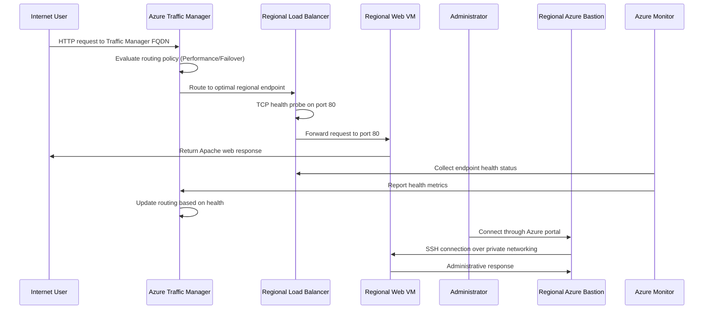

# Azure Traffic Manager with Multi-Region Load Balancing Project

This project demonstrates how to set up Azure Traffic Manager for global traffic distribution across multiple geographic regions in Microsoft Azure. Traffic Manager provides intelligent routing of user traffic to the most optimal endpoint based on performance, geographic proximity, or failover capabilities. This project uses Terraform and bash scripts to automate the deployment and configuration process.

The solution provisions a complete multi-region networking foundation with dedicated networking segments for web and application workloads deployed in both East US and West US regions. Each regional deployment consists of multiple Linux web servers running Apache HTTP Server behind an Azure Load Balancer. Azure Traffic Manager acts as a global load balancer, intelligently routing user requests to the optimal regional endpoint based on configured routing policies.

Overall, the project demonstrates how Terraform can be used to build a resilient, globally distributed Azure infrastructure that combines multi-region networking, regional load balancing, intelligent traffic distribution, and secure administration concepts.

# Architecture solution

In this section we provide a visual representation of the architecture solution, illustrating the various components and their interactions within the Azure environment.

**Virtual Networks:**

- **East US Region:** `10.0.0.0/16`
- **West US Region:** `10.1.0.0/16`

## East US Region Network Segments

| Network Segment        | CIDR Block    | Purpose                                          |
| ---------------------- | ------------- | ------------------------------------------------ |
| **Web Subnet**         | `10.0.1.0/24` | Hosts the public-facing web virtual machines     |
| **Application Subnet** | `10.0.2.0/24` | Reserved for application-tier workloads          |
| **Database Subnet**    | `10.0.3.0/24` | Reserved for database services                   |
| **Management Subnet**  | `10.0.4.0/24` | Used for administrative and management workloads |

## West US Region Network Segments

| Network Segment        | CIDR Block    | Purpose                                          |
| ---------------------- | ------------- | ------------------------------------------------ |
| **Web Subnet**         | `10.1.1.0/24` | Hosts the public-facing web virtual machines     |
| **Application Subnet** | `10.1.2.0/24` | Reserved for application-tier workloads          |
| **Database Subnet**    | `10.1.3.0/24` | Reserved for database services                   |
| **Management Subnet**  | `10.1.4.0/24` | Used for administrative and management workloads |

# Data Flow

In this section, we describe the data flow within the architecture, detailing how requests and responses traverse through the various components across multiple regions.

1. A user sends an HTTP request to the Traffic Manager profile's fully qualified domain name (FQDN).
2. Traffic Manager evaluates the configured routing policy (Performance or Failover).
3. Based on the routing policy and endpoint health, Traffic Manager resolves the DNS query to the optimal regional Load Balancer public IP.
4. The user's request reaches the frontend configuration of the regional Load Balancer.
5. The Standard Load Balancer checks backend availability using TCP health probes on port 80.
6. If instances are healthy, the load balancer forwards the request to port 80 on one of the backend web VMs.
7. Apache returns the static web content installed by the custom script extension.
8. The response travels back through the regional load balancer to the client.
9. Azure Monitor continuously monitors the health of each regional endpoint.
10. Traffic Manager adjusts routing decisions based on health status, ensuring traffic is directed only to healthy regions.
11. Administrators can securely connect to instances in any region through Azure Bastion over private networks.

## Components of the Solution

The environment is composed of several Azure services deployed across multiple regions that work together to provide global traffic distribution, regional load balancing, and secure administration.

| Component                           | Purpose                                                                                                                                             |
| ----------------------------------- | --------------------------------------------------------------------------------------------------------------------------------------------------- |
| **Azure Traffic Manager**           | Provides intelligent global traffic distribution based on routing policy (Performance or Failover) across multiple regional endpoints.              |
| **Regional Virtual Networks**       | Provide private network boundaries for each region and connect the different application tiers within each region.                                  |
| **Web Subnets**                     | Host the Linux web servers in each region that serve the application.                                                                               |
| **Application Subnets**             | Reserved for future application-tier workloads and internal services in each region.                                                                |
| **Database Subnets**                | Reserved for future database services and backend data workloads in each region.                                                                    |
| **Management Subnets**              | Provide dedicated network segments for administrative and management resources in each region.                                                      |
| **Regional Linux Virtual Machines** | Run the Apache web server in each region and host the sample web application across multiple geographic locations.                                  |
| **Regional Load Balancers**         | Provide the regional entry points for the application and distribute incoming traffic across the available web virtual machines within each region. |
| **Health Probes**                   | Continuously check the availability of backend web servers in each region and report status to Traffic Manager.                                     |
| **Public IP Addresses**             | Provide external connectivity for services such as regional Load Balancers and Azure Bastion instances in each region.                              |
| **Network Security Groups**         | Control inbound and outbound network traffic for the different subnets in each region.                                                              |
| **Regional Bastion Services**       | Provide secure administrative access to private virtual machines in each region without requiring direct public IP addresses.                       |

### Component Interaction

At a high level, user requests first reach **Azure Traffic Manager**, which intelligently routes traffic to the optimal regional endpoint based on routing policies and health status. Each regional deployment consists of a **Regional Load Balancer** that distributes requests across web servers in that region.

The **Health Probes** in each region verify that backend instances are available. This health information is reported back to **Traffic Manager**, which uses it to make intelligent routing decisions. If a regional endpoint becomes unhealthy, Traffic Manager automatically routes traffic to other healthy regions, ensuring business continuity.

Each region has its own **Azure Bastion** instance for secure administrative access to private virtual machines, enabling management without direct internet exposure. **Network Security Groups** provide traffic filtering between the different network segments within each region.

The application and database subnets in each region are reserved for future workloads, allowing the environment to evolve into a complete multi-tier, multi-region architecture without redesigning the underlying network.

# Conclusion

Project `02-Project03-TrafficManager` extends the foundational Azure web application architecture from previous projects by introducing global traffic distribution across multiple geographic regions.

The solution deploys identical infrastructure in both East US and West US regions. Each region contains multiple Ubuntu 22.04 Linux web servers in dedicated web subnets, with Azure Load Balancers distributing TCP port `80` traffic across healthy instances.

Azure Traffic Manager sits at the global level, intelligently routing user traffic based on configured policies (Performance routing directs users to the lowest-latency endpoint; Failover routing provides automatic failover to healthy regions). The broader multi-region network architecture includes dedicated web, application, database, management, and Azure Bastion subnets in each region.

This project demonstrates a production-ready approach to global application delivery on Azure, combining the regional networking and load balancing from previous projects with global intelligent traffic distribution through Traffic Manager. The multi-region architecture provides geographic redundancy, disaster recovery capabilities, and improved performance through proximity-based routing. The application and database subnets remain provisioned as architectural placeholders for future services and expansion into a complete multi-tier, multi-region solution.
