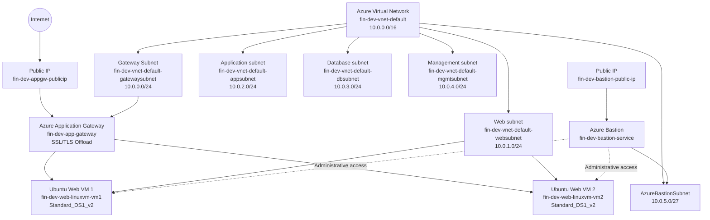
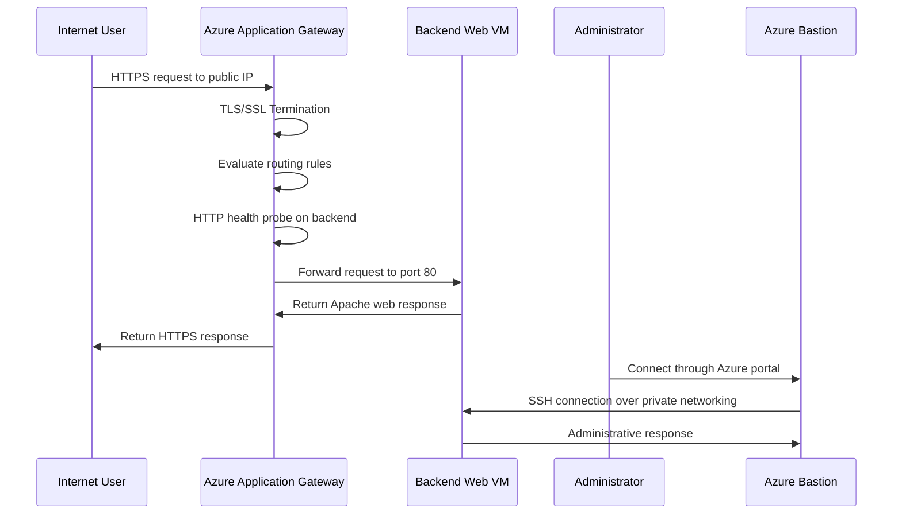

# Azure Application Gateway with Advanced Routing Project

This project demonstrates how to set up an Azure Application Gateway in Microsoft Azure to provide advanced Layer 7 (application layer) load balancing with SSL/TLS termination, URL-based routing, and host-based routing capabilities. Terraform and bash scripts automate the deployment and configuration process.

The solution provisions a complete networking foundation with dedicated networking segments for web and application workloads. The deployed workload consists of multiple Linux web servers running Apache HTTP Server managed by an Azure Application Gateway, enabling intelligent request routing based on URL paths and hostnames. The Application Gateway handles SSL/TLS encryption and decryption, providing secure HTTPS communication while managing complex routing rules at the application layer.

The architecture provides advanced traffic management capabilities including multi-site hosting, SSL/TLS offloading, and granular application-level routing rules. Administrative access to private virtual machines is supported through Azure Bastion for secure management, allowing the servers to remain isolated from direct public exposure while the Application Gateway exposes only necessary endpoints to the internet.

Overall, the project demonstrates how Terraform can be used to build a production-ready Azure infrastructure that combines networking, compute, advanced load balancing, and secure administration concepts at the application layer.

# Architecture solution

In this section we provide a visual representation of the architecture solution, illustrating the various components and their interactions within the Azure environment.

**Virtual Network:** `10.0.0.0/16`

| Network Segment        | CIDR Block    | Purpose                                          |
| ---------------------- | ------------- | ------------------------------------------------ |
| **Gateway Subnet**     | `10.0.0.0/24` | Hosts the Application Gateway                    |
| **Web Subnet**         | `10.0.1.0/24` | Hosts the backend web virtual machines           |
| **Application Subnet** | `10.0.2.0/24` | Reserved for application-tier workloads          |
| **Database Subnet**    | `10.0.3.0/24` | Reserved for database services                   |
| **Management Subnet**  | `10.0.4.0/24` | Used for administrative and management workloads |
| **AzureBastionSubnet** | `10.0.5.0/27` | Dedicated subnet required by Azure Bastion       |

# Data Flow

In this section, we describe the data flow within the architecture, detailing how requests and responses traverse through the various components.

1. A user sends an HTTPS request to the public IP address attached to the Azure Application Gateway.
2. The Application Gateway terminates the SSL/TLS connection, decrypting the user's request.
3. The gateway evaluates the incoming request against configured routing rules based on URL paths or hostnames.
4. The Application Gateway checks backend availability using HTTP health probes on port 80.
5. If instances are healthy, the gateway forwards the request to the appropriate backend pool.
6. The request is sent to one of the available backend web VMs:
   - `fin-dev-web-linuxvm-vm1`
   - `fin-dev-web-linuxvm-vm2`
7. Apache returns the static web content installed by the custom script extension.
8. The response travels back through the Application Gateway to the client.
9. The Application Gateway re-encrypts the response using TLS/SSL before sending it to the user.
10. Administrators can securely connect to any instance through Azure Bastion over the private network.

## Components of the Solution

The environment is composed of several Azure services that work together to provide networking, advanced load balancing, compute, and secure administration.

| Component                     | Purpose                                                                                                                           |
| ----------------------------- | --------------------------------------------------------------------------------------------------------------------------------- |
| **Azure Virtual Network**     | Provides the private network boundary for the environment and connects the different application tiers.                           |
| **Gateway Subnet**            | Dedicated subnet that hosts the Application Gateway.                                                                              |
| **Web Subnet**                | Hosts the Linux web servers that serve the application behind the Application Gateway.                                            |
| **Application Subnet**        | Reserved for future application-tier workloads and internal services.                                                             |
| **Database Subnet**           | Reserved for future database services and backend data workloads.                                                                 |
| **Management Subnet**         | Provides a dedicated network segment for administrative and management resources.                                                 |
| **AzureBastionSubnet**        | Dedicated subnet required by the Azure Bastion managed service.                                                                   |
| **Azure Application Gateway** | Provides Layer 7 load balancing with SSL/TLS offloading, URL-based routing, and host-based routing capabilities.                  |
| **Backend Pools**             | Collections of backend resources (VMs) that receive traffic routed by the Application Gateway.                                    |
| **HTTP Settings**             | Define how the Application Gateway communicates with backend resources, including protocol, port, and health probe configuration. |
| **Listeners**                 | Accept incoming traffic on specified protocols and ports, supporting multiple SSL/TLS certificates for multi-site scenarios.      |
| **Routing Rules**             | Map listeners to backend pools using URL paths, hostnames, or other criteria for intelligent request routing.                     |
| **SSL/TLS Certificates**      | Enable HTTPS communication, with the gateway handling encryption/decryption while backends communicate over HTTP.                 |
| **Health Probes**             | Continuously check the availability of backend servers so that traffic is sent only to healthy instances.                         |
| **Linux Virtual Machines**    | Run the Apache web server and host the sample web application behind the Application Gateway.                                     |
| **Public IP Address**         | Provides the public entry point for the Application Gateway and external connectivity.                                            |
| **Network Security Groups**   | Control inbound and outbound network traffic for the different subnets.                                                           |
| **Azure Bastion**             | Provides secure administrative access to private virtual machines without requiring direct public IP addresses.                   |

### Component Interaction

At a high level, incoming HTTPS traffic reaches the **Azure Application Gateway**, which terminates the SSL/TLS connection for encryption offloading. The gateway evaluates the request against configured **Routing Rules** based on URL paths or hostnames, and routes the traffic to the appropriate **Backend Pool**.

The **Health Probes** verify that backend instances are available before they receive traffic. The Application Gateway communicates with backends over HTTP (or HTTPS), while presenting an encrypted interface to end users.

The **HTTP Settings** define how the gateway communicates with backend resources, including health check parameters and connection settings. Multiple **Listeners** can be configured to accept traffic on different protocols and ports, each with their own SSL/TLS certificate if needed.

Administrative access is provided through **Azure Bastion** over the private network, enabling secure management of backend instances. **Network Security Groups** provide traffic filtering between the different network segments.

The application and database subnets are currently reserved for future workloads, allowing the environment to evolve into a complete multi-tier architecture without redesigning the underlying network.

# Conclusion

Project `03-Project04-ApplicationGateway` extends the foundational Azure web application architecture from previous projects by introducing advanced Layer 7 load balancing capabilities through an Azure Application Gateway.

The solution provisions an Application Gateway in the 10.0.0.0/24 gateway subnet and multiple Ubuntu 22.04 Linux web servers in the 10.0.1.0/24 web subnet. The Application Gateway exposes the application through its public IP, handling SSL/TLS termination and distributing traffic to backend web VMs based on configured routing rules.

The broader `10.0.0.0/16` virtual network is divided into dedicated gateway, web, application, database, management, and Azure Bastion subnets. The Application Gateway supports URL-based routing, host-based routing, and multiple listeners for multi-site scenarios.

This project demonstrates a production-ready approach to advanced application-layer traffic management on Azure, combining the networking foundation from earlier projects with sophisticated Layer 7 load balancing through the Application Gateway. SSL/TLS offloading reduces computational load on backend servers while providing secure HTTPS communication to clients. The application and database subnets remain provisioned as architectural placeholders for future services and expansion of the solution into a complete multi-tier application with multiple backend services.
