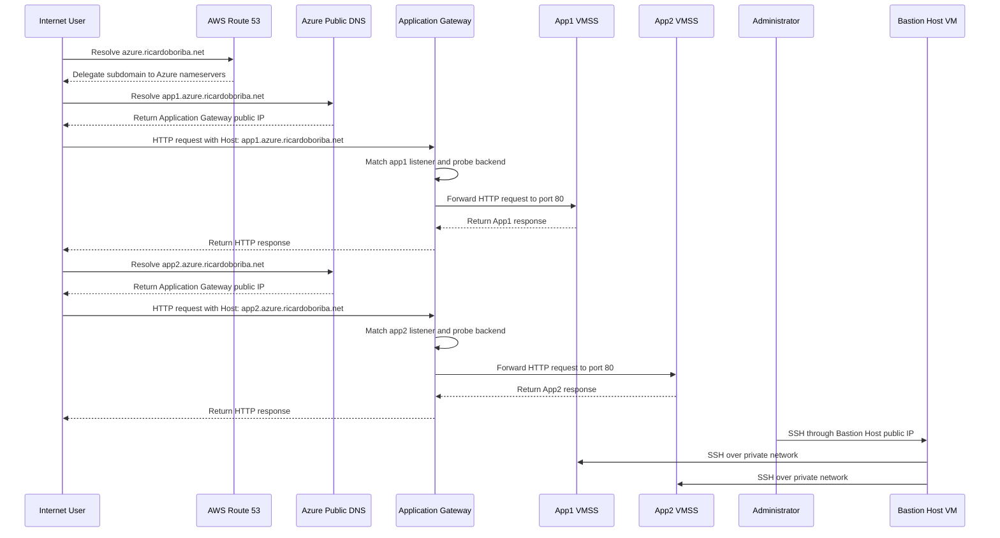

# Azure Application Gateway with Host-Based Routing

This project deploys an Azure Application Gateway that routes HTTP requests to two independent Linux Virtual Machine Scale Sets (VMSS) by hostname. Terraform provision the networking, gateway, backend VMSS instances, public DNS records, NAT Gateway, and a dedicated management host. And it uses bash scripts to automate the deployment and configuration process.

The Application Gateway uses the Basic SKU with two instances. It listens on HTTP port `80` and routes requests for `app1.azure.ricardoboriba.net` and `app2.azure.ricardoboriba.net` to separate backend pools. Each backend pool contains a two-instance Ubuntu 22.04 VMSS. The gateway performs application-level HTTP health checks against `/app1/status.html` and `/app2/status.html` before forwarding traffic.

The project also demonstrates hybrid DNS ownership. Azure DNS hosts the `azure.ricardoboriba.net` public subdomain, while AWS Route 53 delegates that subdomain from the parent `ricardoboriba.net` zone through an NS record. A NAT Gateway provides outbound access for the web subnet, and a regular management subnet contains a Bastion Host Linux VM for administration.

# Architecture solution

In this section we provide a visual representation of the architecture solution, illustrating the various components and their interactions within the Azure environment.

**Virtual Network:** `10.0.0.0/16`

| Network Segment                | CIDR Block     | Purpose                                                                |
| ------------------------------ | -------------- | ---------------------------------------------------------------------- |
| **Application Gateway Subnet** | `10.0.51.0/24` | Hosts the Azure Application Gateway                                    |
| **Web Subnet**                 | `10.0.1.0/24`  | Hosts both backend VMSS resources and receives NAT Gateway association |
| **Application Subnet**         | `10.0.2.0/24`  | Reserved for future application-tier workloads                         |
| **Database Subnet**            | `10.0.3.0/24`  | Reserved for future database services                                  |
| **Management Subnet**          | `10.0.4.0/24`  | Hosts the Bastion Host Linux VM for administrative access              |

# Data Flow

The request flow is based on public DNS hostnames and Application Gateway listener rules. The gateway does not terminate TLS in this configuration because both listeners and backend HTTP settings use HTTP on port `80`.

1. AWS Route 53 delegates `azure.ricardoboriba.net` to the nameservers assigned to the Azure DNS zone.
2. Azure DNS records `app1` and `app2` both resolve to the Application Gateway public IP.
3. The client sends an HTTP request to the Application Gateway on port `80` with the requested hostname.
4. The matching HTTP listener selects the App1 or App2 routing rule based on the host header.
5. The gateway checks the selected backend pool with its HTTP probe:
   - App1: `/app1/status.html`, expecting body `App1` and status `200`
   - App2: `/app2/status.html`, expecting body `App2` and status `200`
6. The gateway forwards healthy traffic to the selected VMSS backend over HTTP port `80`.
7. Each VMSS contains two Ubuntu 22.04 instances running content installed by its custom data script.
8. The response returns through the Application Gateway to the client.
9. VMSS instances use the NAT Gateway associated with the Web Subnet for outbound internet traffic.
10. Administrators use the Bastion Host Linux VM in the Management Subnet to reach both VMSS tiers over private addresses.

## Components of the Solution

| Component                      | Purpose                                                                                                |
| ------------------------------ | ------------------------------------------------------------------------------------------------------ |
| **Azure Virtual Network**      | Provides the `10.0.0.0/16` private network boundary.                                                   |
| **Application Gateway Subnet** | `10.0.51.0/24`; dedicated subnet required by the Application Gateway.                                  |
| **Web Subnet**                 | `10.0.1.0/24`; hosts both VMSS resources and is associated with the NAT Gateway.                       |
| **Application Subnet**         | `10.0.2.0/24`; reserved for future application services.                                               |
| **Database Subnet**            | `10.0.3.0/24`; reserved for future database services.                                                  |
| **Management Subnet**          | `10.0.4.0/24`; hosts the Bastion Host Linux VM.                                                        |
| **Azure Application Gateway**  | Basic SKU with two instances; accepts HTTP on port `80` and routes by hostname.                        |
| **App1 HTTP Listener**         | Listens for `app1.azure.ricardoboriba.net` and routes to the App1 backend pool.                        |
| **App2 HTTP Listener**         | Listens for `app2.azure.ricardoboriba.net` and routes to the App2 backend pool.                        |
| **App1 Web VMSS**              | `fin-eastus-web-vmss-app1`; two Ubuntu 22.04 instances in the Web Subnet.                              |
| **App2 Web VMSS**              | `fin-eastus-web-vmss-app2`; two Ubuntu 22.04 instances in the Web Subnet.                              |
| **Backend HTTP Settings**      | Send traffic to each VMSS over HTTP port `80` with a 60-second request timeout.                        |
| **HTTP Health Probes**         | Validate the App1 and App2 status paths, response body, and HTTP status before routing traffic.        |
| **Azure Public DNS Zone**      | Hosts `azure.ricardoboriba.net` and the `app1` and `app2` A records.                                   |
| **AWS Route 53 Delegation**    | Creates the parent-zone NS record that delegates `azure.ricardoboriba.net` to Azure DNS nameservers.   |
| **NAT Gateway**                | Provides outbound internet access for the Web Subnet through a dedicated public IP.                    |
| **Bastion Host Linux VM**      | Ubuntu 22.04 management VM with a public IP for SSH access to private VMSS instances.                  |
| **Network Security Groups**    | Filter traffic for the gateway, web, application, database, and management subnets and VMSS resources. |

### Component Interaction

The public DNS records provide two hostnames but a single Application Gateway public endpoint. Host-based listeners distinguish App1 from App2, and each routing rule targets its own backend pool. This keeps the two application workloads independently deployable while sharing the gateway and Web Subnet.

The Application Gateway performs HTTP health checks against application-specific status pages. It forwards requests only when the expected status code and response body are present. Backend HTTP settings disable cookie affinity and use a 60-second request timeout.

AWS Route 53 remains authoritative for the parent domain, while Azure DNS is authoritative for the delegated `azure` subdomain. Terraform reads the AWS parent zone and creates the NS delegation record using the nameservers returned by the Azure DNS zone.

The NAT Gateway is attached to the Web Subnet only. It provides outbound connectivity for both VMSS resources without assigning public IP addresses to their instances. The Bastion Host is a Linux VM in the regular Management Subnet.

# Conclusion

Project `03-Project04-ApplicationGateway` demonstrates hostname-based Layer 7 routing with two independent application VMSS resources behind a shared Azure Application Gateway.

The deployment contains two two-instance Ubuntu 22.04 VMSS backends, separate HTTP listeners and health probes for App1 and App2, an Application Gateway in the `10.0.51.0/24` subnet, public DNS records in Azure, and AWS Route 53 subdomain delegation. The Web Subnet uses a NAT Gateway for outbound connectivity, while a dedicated management subnet contains a Bastion Host Linux VM for administration.

This project is an HTTP host-routing example. Although the Application Gateway supports richer Layer 7 capabilities, the current Terraform configuration does not provision TLS certificates, HTTPS listeners, WAF policy, URL path maps, or a managed Azure Bastion service.
