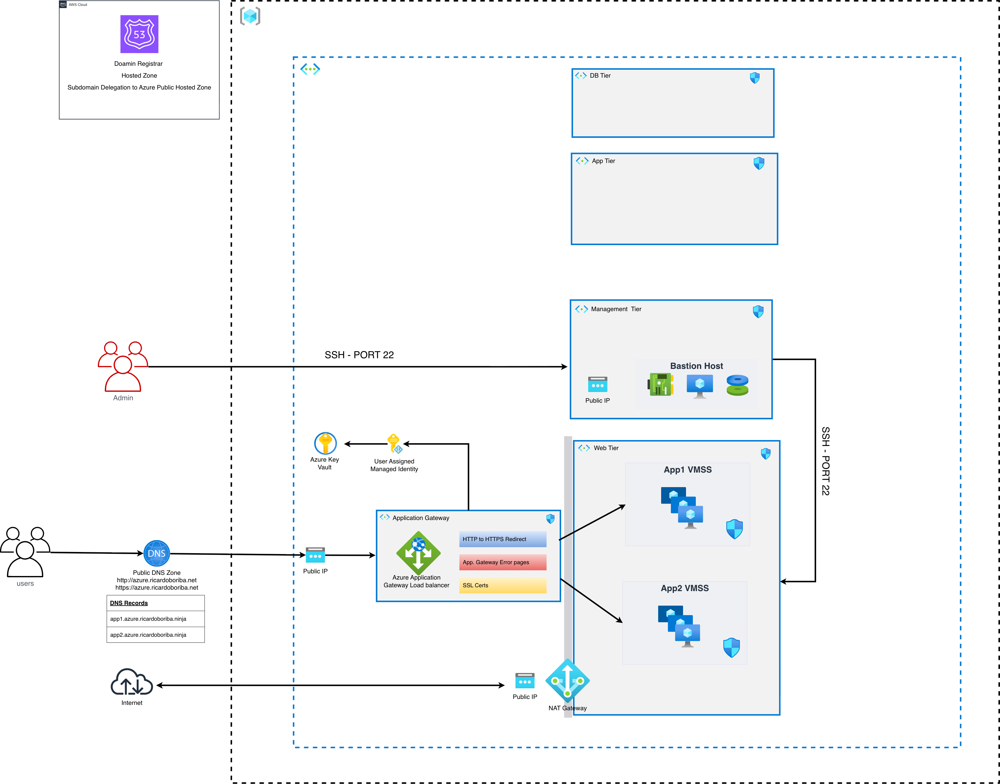
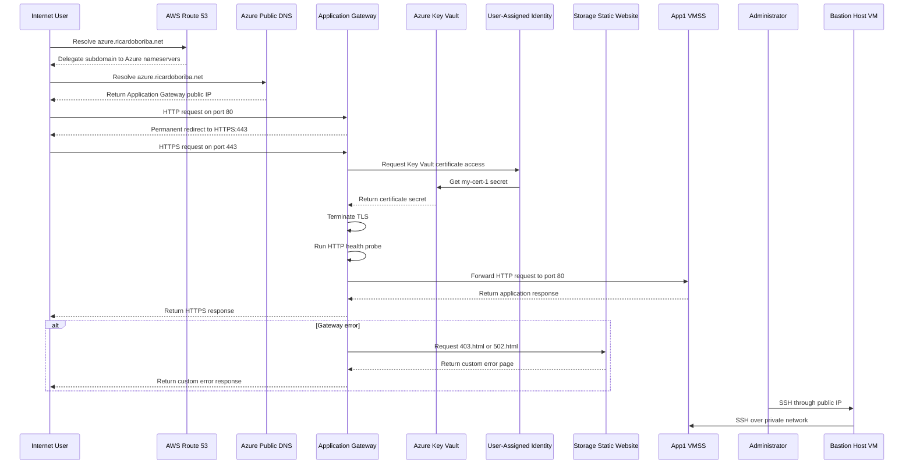

# Azure Application Gateway with SSL/TLS, Key Vault, and Custom Error Pages

This project deploys an Azure Application Gateway that redirects HTTP traffic to HTTPS, terminates TLS with a certificate stored in Azure Key Vault, and forwards requests to a two-instance Linux Virtual Machine Scale Set (VMSS). Terraform also provisions Azure Storage static website hosting for custom error pages, Azure Public DNS, AWS Route 53 subdomain delegation, a NAT Gateway, and a Linux management host.

The current Terraform configuration contains **one VMSS resource with two instances**. It does not define two separate VMSS tiers. The two instances share the Web Subnet and are registered in the Application Gateway backend pool.

The Application Gateway uses the Basic SKU with capacity `2`. HTTP requests on port `80` are permanently redirected to HTTPS on port `443`. The HTTPS listener uses a certificate imported into Key Vault and referenced through a user-assigned managed identity. The gateway serves custom `403.html` and `502.html` pages from the Storage Account static website endpoint when the corresponding listener errors occur.

# Architecture solution

The deployment uses one Azure virtual network with separate subnets for the Application Gateway, Web VMSS, application, database, and management workloads. Administrative access is provided by a regular Linux VM in the Management Subnet.

**Virtual Network:** `10.0.0.0/16`

| Network Segment                | CIDR Block     | Purpose                                                               |
| ------------------------------ | -------------- | --------------------------------------------------------------------- |
| **Application Gateway Subnet** | `10.0.51.0/24` | Hosts the Application Gateway                                         |
| **Web Subnet**                 | `10.0.1.0/24`  | Hosts the two-instance App1 VMSS and receives NAT Gateway association |
| **Application Subnet**         | `10.0.2.0/24`  | Reserved for future application-tier workloads                        |
| **Database Subnet**            | `10.0.3.0/24`  | Reserved for future database services                                 |
| **Management Subnet**          | `10.0.4.0/24`  | Hosts the Bastion Host Linux VM                                       |

# Data Flow

The traffic flow has two stages: Azure DNS resolution and HTTP-to-HTTPS redirection, followed by HTTPS termination and backend forwarding. The certificate is loaded from Key Vault by the Application Gateway through its user-assigned managed identity.

1. AWS Route 53 delegates `azure.ricardoboriba.net` to the nameservers assigned to the Azure DNS zone.
2. The Azure apex record `azure.ricardoboriba.net` resolves to the Application Gateway public IP.
3. HTTP requests on port `80` are permanently redirected to the HTTPS listener on port `443`, preserving the path and query string.
4. The Application Gateway uses its user-assigned managed identity to access the certificate secret in Key Vault.
5. The gateway terminates TLS and evaluates the HTTPS request.
6. The App1 HTTP probe checks `/app1/status.html` and expects response body `App1` with status `200`.
7. Healthy traffic is forwarded over HTTP port `80` to the two-instance Ubuntu 22.04 VMSS.
8. For configured `403` or `502` listener errors, the gateway retrieves the corresponding HTML page from the Storage Account static website endpoint.
9. The NAT Gateway provides outbound internet access for the Web Subnet.
10. Administrators use the Bastion Host Linux VM in the Management Subnet to reach the private VMSS instances.

## Components of the Solution

| Component                          | Purpose                                                                                                 |
| ---------------------------------- | ------------------------------------------------------------------------------------------------------- |
| **Azure Virtual Network**          | Provides the `10.0.0.0/16` private network boundary.                                                    |
| **Application Gateway Subnet**     | `10.0.51.0/24`; dedicated subnet for the Application Gateway.                                           |
| **Web Subnet**                     | `10.0.1.0/24`; hosts the two-instance VMSS and is associated with the NAT Gateway.                      |
| **Application Subnet**             | `10.0.2.0/24`; reserved for future application services.                                                |
| **Database Subnet**                | `10.0.3.0/24`; reserved for future database services.                                                   |
| **Management Subnet**              | `10.0.4.0/24`; hosts the Bastion Host Linux VM.                                                         |
| **Azure Application Gateway**      | Basic SKU with capacity 2; redirects HTTP to HTTPS and terminates TLS on port 443.                      |
| **HTTP Listener**                  | Listens on port 80 and permanently redirects requests to the HTTPS listener.                            |
| **HTTPS Listener**                 | Listens on port 443 and uses the Key Vault certificate for TLS termination.                             |
| **App1 Web VMSS**                  | One VMSS resource with two Ubuntu 22.04 instances.                                                      |
| **Backend HTTP Settings**          | Forward requests to the VMSS over HTTP port 80 with a 60-second request timeout and no cookie affinity. |
| **HTTP Health Probe**              | Checks `/app1/status.html` every 30 seconds and expects body `App1` with HTTP status `200`.             |
| **Azure Key Vault**                | Stores the imported certificate used by the HTTPS listener.                                             |
| **User-Assigned Managed Identity** | Attached to the Application Gateway and granted `Get` secret permission on the Key Vault.               |
| **Storage Account**                | Enables static website hosting and stores custom HTML error pages.                                      |
| **Static Website Container**       | Azure-managed `$web` container containing `index.html`, `error.html`, `403.html`, and `502.html`.       |
| **Azure Public DNS Zone**          | Hosts `azure.ricardoboriba.net` and an apex A record targeting the Application Gateway public IP.       |
| **AWS Route 53 Delegation**        | Creates the parent-zone NS record delegating `azure.ricardoboriba.net` to Azure DNS nameservers.        |
| **NAT Gateway**                    | Provides outbound internet access for the Web Subnet through a dedicated public IP.                     |
| **Bastion Host Linux VM**          | Ubuntu 22.04 management VM with a public IP for SSH access to private workload instances.               |
| **Network Security Groups**        | Filter traffic for the gateway, web, application, database, and management subnets and VMSS resources.  |

### Component Interaction

Azure DNS provides the public apex record for the delegated subdomain, and the record points to the Application Gateway public IP. AWS Route 53 remains authoritative for `ricardoboriba.net` and delegates the `azure` child zone through the NS record Terraform creates.

The Application Gateway accepts HTTP and HTTPS on separate frontend ports. HTTP requests are redirected permanently to HTTPS. The HTTPS listener references the Key Vault certificate through its secret ID and uses the user-assigned identity attached to the gateway to retrieve the certificate secret.

The Key Vault access model uses access policies rather than Azure RBAC. The Terraform deployment grants the current deployment identity broad management permissions required to import the certificate and grants the Application Gateway identity only `Get` permission for secrets. The PFX file is read from `/etc/ssl/httpd.pfx`, and its password is supplied through the sensitive `password_httpd_ssl_pfx` variable.

The Storage Account static website hosts the HTML files used for custom gateway error responses. The gateway references the static web endpoint for `403.html` and `502.html`. This is error-page hosting only.

# Conclusion

Project `04-Project05-ApplicationGateway-SSL` demonstrates secure HTTPS application delivery with Azure Application Gateway, Key Vault certificate retrieval, public DNS delegation, custom error-page hosting, and a two-instance Linux VMSS backend.

The deployment includes an Application Gateway in the `10.0.51.0/24` subnet, one App1 VMSS resource with two Ubuntu 22.04 instances in the `10.0.1.0/24` Web Subnet, HTTP-to-HTTPS redirection, TLS termination on port `443`, and an imported PFX certificate managed by Azure Key Vault. Azure DNS hosts the public apex record, while AWS Route 53 delegates the Azure subdomain.

This project does not deploy a Web Application Firewall or managed Azure Bastion. The custom `403` and `502` pages improve gateway error handling, while the NAT Gateway and Linux management host provide outbound connectivity and administration. A separate VMSS tier, WAF policy, or managed Bastion service would require additional Terraform resources beyond the current configuration.
