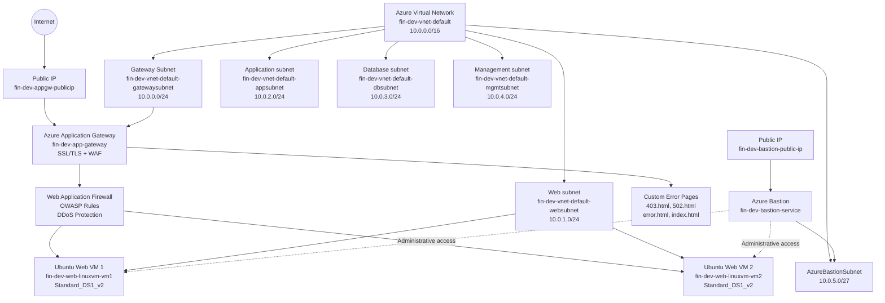
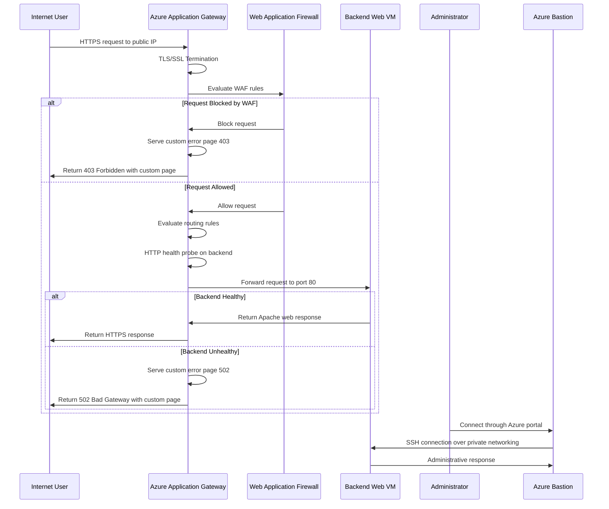

# Azure Application Gateway with SSL/TLS and Custom Error Pages Project

This project demonstrates how to set up an Azure Application Gateway in Microsoft Azure with advanced SSL/TLS configuration, custom error pages, and Web Application Firewall (WAF) capabilities. Terraform and bash scripts automate the deployment and configuration process.

The solution provisions a complete networking foundation with dedicated networking segments for web and application workloads. The deployed workload consists of multiple Linux web servers running Apache HTTP Server managed by an Azure Application Gateway, providing secure HTTPS communication with SSL/TLS termination, intelligent error handling through custom error pages, and optional Web Application Firewall protection against common web vulnerabilities.

The architecture provides enterprise-grade security and user experience management capabilities including SSL/TLS encryption, custom error page handling for improved user experience during failures, and optional WAF rules for protection against web attacks. Administrative access to private virtual machines is supported through Azure Bastion for secure management, allowing the servers to remain isolated from direct public exposure while the Application Gateway provides a hardened security boundary.

Overall, the project demonstrates how Terraform can be used to build an enterprise-ready Azure infrastructure that combines networking, compute, advanced load balancing, security features, and secure administration concepts.

# Architecture solution

In this section we provide a visual representation of the architecture solution, illustrating the various components and their interactions within the Azure environment.

**Virtual Network:** `10.0.0.0/16`

| Network Segment        | CIDR Block    | Purpose                                          |
| ---------------------- | ------------- | ------------------------------------------------ |
| **Gateway Subnet**     | `10.0.0.0/24` | Hosts the Application Gateway                    |
| **Web Subnet**         | `10.0.1.0/24` | Hosts the backend web virtual machines           |
| **Application Subnet** | `10.0.2.0/24` | Reserved for application-tier workloads          |
| **Database Subnet**    | `10.0.3.0/24` | Reserved for database services                   |
| **Management Subnet**  | `10.0.4.0/24` | Used for administrative and management workloads |
| **AzureBastionSubnet** | `10.0.5.0/27` | Dedicated subnet required by Azure Bastion       |

# Data Flow

In this section, we describe the data flow within the architecture, detailing how requests and responses traverse through the various components with security and error handling.

1. A user sends an HTTPS request to the public IP address attached to the Azure Application Gateway.
2. The Application Gateway terminates the SSL/TLS connection, decrypting the user's request.
3. The Web Application Firewall evaluates the incoming request against OWASP protection rules and DDoS thresholds.
4. If the request is blocked by WAF rules, the gateway serves a custom 403 Forbidden error page.
5. If the request passes WAF inspection, the Application Gateway evaluates configured routing rules.
6. The gateway checks backend availability using HTTP health probes on port 80.
7. If all backends are unhealthy, the gateway serves a custom 502 Bad Gateway error page.
8. If instances are healthy, the gateway forwards the request to the appropriate backend pool.
9. The request is sent to one of the available backend web VMs:
   - `fin-dev-web-linuxvm-vm1`
   - `fin-dev-web-linuxvm-vm2`
10. Apache returns the static web content installed by the custom script extension.
11. The response travels back through the Application Gateway to the client.
12. The Application Gateway re-encrypts the response using TLS/SSL before sending it to the user.
13. Administrators can securely connect to any instance through Azure Bastion over the private network.

## Components of the Solution

The environment is composed of several Azure services that work together to provide networking, advanced load balancing, security, compute, and secure administration.

| Component                          | Purpose                                                                                                                           |
| ---------------------------------- | --------------------------------------------------------------------------------------------------------------------------------- |
| **Azure Virtual Network**          | Provides the private network boundary for the environment and connects the different application tiers.                           |
| **Gateway Subnet**                 | Dedicated subnet that hosts the Application Gateway and Web Application Firewall.                                                 |
| **Web Subnet**                     | Hosts the Linux web servers that serve the application behind the Application Gateway.                                            |
| **Application Subnet**             | Reserved for future application-tier workloads and internal services.                                                             |
| **Database Subnet**                | Reserved for future database services and backend data workloads.                                                                 |
| **Management Subnet**              | Provides a dedicated network segment for administrative and management resources.                                                 |
| **AzureBastionSubnet**             | Dedicated subnet required by the Azure Bastion managed service.                                                                   |
| **Azure Application Gateway**      | Provides Layer 7 load balancing with SSL/TLS offloading, URL-based routing, and WAF integration.                                  |
| **Web Application Firewall (WAF)** | Protects against common web vulnerabilities (OWASP Top 10), SQL injection, cross-site scripting, and DDoS attacks.                |
| **Backend Pools**                  | Collections of backend resources (VMs) that receive traffic routed by the Application Gateway.                                    |
| **HTTP Settings**                  | Define how the Application Gateway communicates with backend resources, including protocol, port, and health probe configuration. |
| **Listeners**                      | Accept incoming traffic on specified protocols and ports, supporting multiple SSL/TLS certificates for multi-site scenarios.      |
| **Routing Rules**                  | Map listeners to backend pools using URL paths, hostnames, or other criteria for intelligent request routing.                     |
| **SSL/TLS Certificates**           | Enable HTTPS communication with the gateway handling encryption/decryption while backends communicate over HTTP.                  |
| **Custom Error Pages**             | User-friendly HTML pages served when errors occur (403 Forbidden, 502 Bad Gateway, etc.) for improved user experience.            |
| **Health Probes**                  | Continuously check the availability of backend servers so that traffic is sent only to healthy instances.                         |
| **Linux Virtual Machines**         | Run the Apache web server and host the sample web application behind the Application Gateway.                                     |
| **Public IP Address**              | Provides the public entry point for the Application Gateway and external connectivity.                                            |
| **Network Security Groups**        | Control inbound and outbound network traffic for the different subnets.                                                           |
| **Azure Bastion**                  | Provides secure administrative access to private virtual machines without requiring direct public IP addresses.                   |

### Component Interaction

At a high level, incoming HTTPS traffic reaches the **Azure Application Gateway**, which terminates the SSL/TLS connection for encryption offloading. Traffic is then evaluated by the **Web Application Firewall** to protect against web attacks and vulnerabilities.

If a request is blocked by WAF rules, a **Custom Error Page** (403 Forbidden) is served to the user. If the request passes WAF inspection, the Application Gateway evaluates **Routing Rules** based on URL paths or hostnames and routes traffic to the appropriate **Backend Pool**.

The **Health Probes** verify that backend instances are available. If all backends are unhealthy, the gateway serves a custom **Error Page** (502 Bad Gateway). The Application Gateway communicates with backends over HTTP while presenting an encrypted HTTPS interface to end users.

**HTTP Settings** define how the gateway communicates with backend resources, including health check parameters. Multiple **Listeners** can be configured with their own SSL/TLS certificates for multi-site hosting scenarios.

Administrative access is provided through **Azure Bastion** over the private network, enabling secure management of backend instances. **Network Security Groups** provide traffic filtering between network segments.

The application and database subnets are currently reserved for future workloads, allowing the environment to evolve into a complete multi-tier architecture without redesigning the underlying network.

# Conclusion

Project `04-Project05-ApplicationGateway-SSL` extends the Azure Application Gateway foundation from Project 04 by adding comprehensive SSL/TLS security, custom error page handling, and Web Application Firewall protection.

The solution provisions an Application Gateway with integrated WAF in the 10.0.0.0/24 gateway subnet and multiple Ubuntu 22.04 Linux web servers in the 10.0.1.0/24 web subnet. The Application Gateway exposes the application through HTTPS with SSL/TLS termination, protecting against web vulnerabilities while serving custom error pages for improved user experience during failure scenarios.

The broader `10.0.0.0/16` virtual network is divided into dedicated gateway, web, application, database, management, and Azure Bastion subnets. The Application Gateway integrates OWASP rule-based WAF protection and custom error pages (403, 502) to handle both security and failure scenarios gracefully.

This project demonstrates a production-ready enterprise approach to secure application delivery on Azure, combining the advanced routing from Project 04 with comprehensive security through Web Application Firewall, SSL/TLS encryption, and improved user experience through custom error pages. The integration of WAF reduces the attack surface while SSL/TLS offloading reduces computational load on backend servers. The application and database subnets remain provisioned as architectural placeholders for future services and expansion of the solution into a complete multi-tier, security-hardened application.
