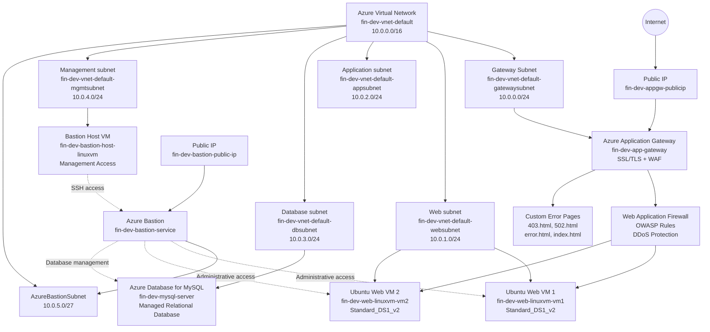
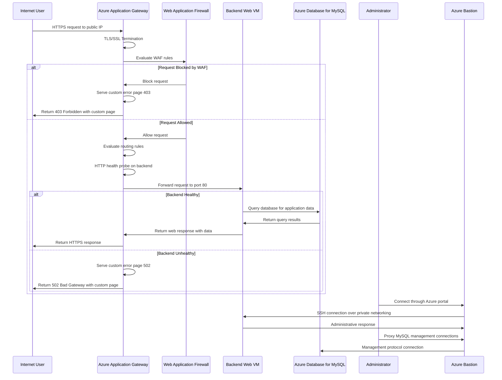

# Azure Application Gateway with MySQL Database Backend Project

This project demonstrates how to set up a complete three-tier Azure application architecture combining an Azure Application Gateway for secure traffic management, web servers for the presentation layer, and Azure Database for MySQL for persistent data storage. Terraform and bash scripts automate the deployment and configuration process.

The solution provisions a complete networking foundation with dedicated networking segments for web, application, database, and management workloads. The deployed workload consists of multiple Linux web servers running Apache HTTP Server with application logic managed by an Azure Application Gateway, connected to an Azure Database for MySQL instance for data persistence. The Application Gateway provides SSL/TLS termination, secure HTTPS communication, and intelligent routing while isolating the database from direct internet exposure.

The architecture provides a production-ready three-tier design pattern with proper network segmentation, SSL/TLS encryption, secure database connectivity, and Web Application Firewall protection. Administrative access to private resources is supported through Azure Bastion, maintaining a security perimeter where only the Application Gateway is exposed to the internet while web servers and the MySQL database remain fully protected in private subnets.

Overall, the project demonstrates how Terraform can be used to build an enterprise-ready Azure infrastructure that combines networking, compute, advanced load balancing, security features, data persistence, and secure administration concepts for a complete application stack.

# Architecture solution

In this section we provide a visual representation of the architecture solution, illustrating the various components and their interactions within the Azure environment.

**Virtual Network:** `10.0.0.0/16`

| Network Segment        | CIDR Block    | Purpose                                          |
| ---------------------- | ------------- | ------------------------------------------------ |
| **Gateway Subnet**     | `10.0.0.0/24` | Hosts the Application Gateway                    |
| **Web Subnet**         | `10.0.1.0/24` | Hosts the backend web virtual machines           |
| **Application Subnet** | `10.0.2.0/24` | Reserved for application-tier workloads          |
| **Database Subnet**    | `10.0.3.0/24` | Hosts the Azure Database for MySQL               |
| **Management Subnet**  | `10.0.4.0/24` | Used for administrative and management workloads |
| **AzureBastionSubnet** | `10.0.5.0/27` | Dedicated subnet required by Azure Bastion       |

# Data Flow

In this section, we describe the data flow within the architecture, detailing how requests and responses traverse through the various components with security and database interactions.

1. A user sends an HTTPS request to the public IP address attached to the Azure Application Gateway.
2. The Application Gateway terminates the SSL/TLS connection, decrypting the user's request.
3. The Web Application Firewall evaluates the incoming request against OWASP protection rules.
4. If the request is blocked by WAF, a custom 403 Forbidden error page is served.
5. If the request passes WAF inspection, the Application Gateway evaluates configured routing rules.
6. The gateway checks backend availability using HTTP health probes on port 80.
7. If instances are healthy, the gateway forwards the request to the appropriate backend pool.
8. The request is sent to one of the available backend web VMs:
   - `fin-dev-web-linuxvm-vm1`
   - `fin-dev-web-linuxvm-vm2`
9. The web server application processes the request and queries the Azure Database for MySQL.
10. MySQL executes the query and returns results back to the web server.
11. The web server processes the data and generates an HTTP response.
12. The response travels back through the Application Gateway to the client.
13. The Application Gateway re-encrypts the response using TLS/SSL before sending it to the user.
14. Administrators can securely connect to web servers through Azure Bastion over the private network.
15. Administrators can manage the MySQL database through proxy connections via Azure Bastion, maintaining network isolation.

## Components of the Solution

The environment is composed of several Azure services that work together to provide networking, advanced load balancing, security, compute, data persistence, and secure administration.

| Component                          | Purpose                                                                                                                           |
| ---------------------------------- | --------------------------------------------------------------------------------------------------------------------------------- |
| **Azure Virtual Network**          | Provides the private network boundary for the environment and connects the different application tiers.                           |
| **Gateway Subnet**                 | Dedicated subnet that hosts the Application Gateway and Web Application Firewall.                                                 |
| **Web Subnet**                     | Hosts the Linux web servers that serve the application and interact with the database.                                            |
| **Application Subnet**             | Reserved for future application-tier workloads and internal services.                                                             |
| **Database Subnet**                | Hosts the Azure Database for MySQL and provides isolated connectivity for database resources.                                     |
| **Management Subnet**              | Provides a dedicated network segment for administrative and management resources.                                                 |
| **AzureBastionSubnet**             | Dedicated subnet required by the Azure Bastion managed service.                                                                   |
| **Azure Application Gateway**      | Provides Layer 7 load balancing with SSL/TLS offloading, URL-based routing, and WAF integration.                                  |
| **Web Application Firewall (WAF)** | Protects against common web vulnerabilities (OWASP Top 10), SQL injection, cross-site scripting, and DDoS attacks.                |
| **Backend Pools**                  | Collections of web servers that receive traffic routed by the Application Gateway.                                                |
| **HTTP Settings**                  | Define how the Application Gateway communicates with backend resources, including protocol, port, and health probe configuration. |
| **Listeners**                      | Accept incoming traffic on specified protocols and ports with SSL/TLS certificates for HTTPS communication.                       |
| **Routing Rules**                  | Map listeners to backend pools using URL paths, hostnames, or other criteria for intelligent request routing.                     |
| **SSL/TLS Certificates**           | Enable HTTPS communication with the gateway handling encryption/decryption while backends communicate over HTTP.                  |
| **Custom Error Pages**             | User-friendly HTML pages served when errors occur (403 Forbidden, 502 Bad Gateway, etc.) for improved user experience.            |
| **Health Probes**                  | Continuously check the availability of backend servers so that traffic is sent only to healthy instances.                         |
| **Azure Database for MySQL**       | Managed relational database providing persistent data storage, automated backups, and high availability for application data.     |
| **Linux Virtual Machines**         | Run web server applications that process user requests and interact with the MySQL database.                                      |
| **Public IP Address**              | Provides the public entry point for the Application Gateway.                                                                      |
| **Network Security Groups**        | Control inbound and outbound network traffic for the different subnets and isolate database connectivity.                         |
| **Azure Bastion**                  | Provides secure administrative access to private virtual machines and database proxy management without direct internet exposure. |
| **Database Connectivity**          | Private network connectivity from web servers to the MySQL database backend with no public IP requirement.                        |

### Component Interaction

At a high level, incoming HTTPS traffic reaches the **Azure Application Gateway**, which terminates the SSL/TLS connection. Traffic is then evaluated by the **Web Application Firewall** to protect against web attacks and vulnerabilities.

If a request is blocked by WAF rules, a **Custom Error Page** (403 Forbidden) is served. If the request passes WAF inspection, the Application Gateway evaluates **Routing Rules** and forwards traffic to the **Backend Pools** (web servers).

Web servers process requests and interact with **Azure Database for MySQL** over private network connections for data retrieval and storage. The database remains completely isolated from internet exposure, accessible only from within the virtual network and via **Azure Bastion** for administrative purposes.

The **Health Probes** verify backend availability. If all backends are unhealthy, the gateway serves a custom **Error Page** (502 Bad Gateway). **HTTP Settings** define communication parameters between the gateway and backends.

Administrative access is provided through **Azure Bastion**, which enables secure management of both web servers and the MySQL database without requiring public IP addresses. **Network Security Groups** provide traffic filtering between network segments, creating a security boundary where only the Application Gateway is internet-facing.

The application and additional application-tier services are reserved for future workloads, allowing the environment to evolve into a complete multi-tier architecture without redesigning the underlying network.

# Conclusion

Project `05-Project06-ApplicationGateway-MySQL` extends the Azure Application Gateway foundation by adding a complete three-tier architecture with a managed MySQL database backend for persistent data storage.

The solution provisions an Application Gateway with integrated WAF in the 10.0.0.0/24 gateway subnet, multiple Ubuntu 22.04 Linux web servers in the 10.0.1.0/24 web subnet, and an Azure Database for MySQL in the 10.0.3.0/24 database subnet. The Application Gateway exposes the application through HTTPS with SSL/TLS termination while maintaining network isolation for backend resources.

The broader `10.0.0.0/16` virtual network is divided into dedicated gateway, web, application, database, management, and Azure Bastion subnets. Web servers communicate with the MySQL database over private network connections, ensuring no database exposure to the internet.

This project demonstrates a production-ready enterprise architecture for complex multi-tier applications on Azure, combining secure user-facing connectivity through Application Gateway, WAF protection, and reliable data persistence through Azure Database for MySQL. The architecture provides high availability, security through network isolation and encryption, and simplified database management through Azure's managed service offering. The complete separation of tiers—with only the gateway exposed publicly—provides defense-in-depth security. The application subnet remains provisioned as an architectural placeholder for future microservices, caching layers, or additional business logic components, enabling evolution into a sophisticated multi-tier, enterprise-grade solution.
