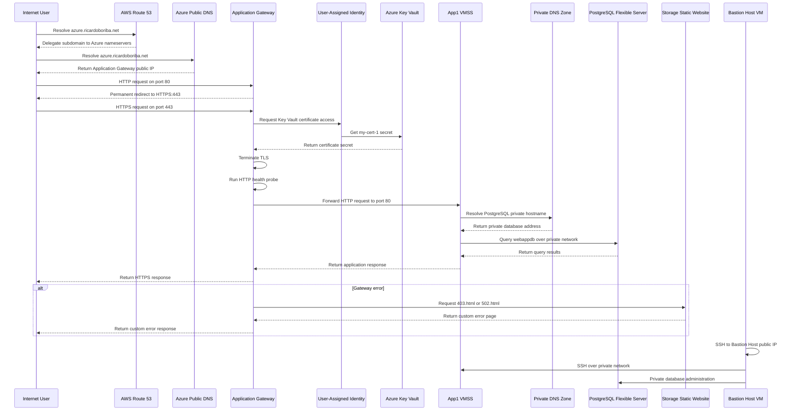

# Azure Application Gateway with PostgreSQL Flexible Server

This project deploys a private three-tier-style Azure architecture with an Application Gateway, a Linux Virtual Machine Scale Set (VMSS), and Azure Database for PostgreSQL Flexible Server. Terraform and bash scripts provision the network, HTTPS gateway, private database connectivity, public DNS delegation, static error pages, outbound NAT, and a Linux management host.

The current Terraform configuration contains **one VMSS resource with two instances**. The instances run Ubuntu 22.04 and host the web workload in the Web Subnet. The VMSS custom data receives the PostgreSQL server FQDN, database name, administrator username, and password so the deployed web configuration can connect to the database.

The Application Gateway uses the Basic SKU with capacity `2`. HTTP requests on port `80` are permanently redirected to HTTPS on port `443`. TLS is terminated with the certificate imported into Azure Key Vault and accessed through a user-assigned managed identity. Custom `403.html` and `502.html` pages are hosted through the Storage Account static website endpoint.

# Architecture solution

The deployment uses one Azure virtual network with dedicated subnets for the Application Gateway, web workload, future application services, PostgreSQL, and management. The PostgreSQL subnet is delegated to `Microsoft.DBforPostgreSQL/flexibleServers`, and its private DNS zone is linked to the virtual network. Public application DNS is hosted in Azure and delegated from AWS Route 53.

**Virtual Network:** `10.0.0.0/16`

| Network Segment                | CIDR Block     | Purpose                                                                |
| ------------------------------ | -------------- | ---------------------------------------------------------------------- |
| **Application Gateway Subnet** | `10.0.51.0/24` | Hosts the Application Gateway                                          |
| **Web Subnet**                 | `10.0.1.0/24`  | Hosts the two-instance App1 VMSS and receives NAT Gateway association  |
| **Application Subnet**         | `10.0.2.0/24`  | Reserved for future application-tier workloads                         |
| **Database Subnet**            | `10.0.3.0/24`  | Delegated to PostgreSQL Flexible Server and hosts the private database |
| **Management Subnet**          | `10.0.4.0/24`  | Hosts the Bastion Host Linux VM                                        |

# Data Flow

The request path uses Azure public DNS, HTTP-to-HTTPS redirection, Application Gateway TLS termination, and private forwarding to the VMSS. The web workload then connects to PostgreSQL through the private network and resolves the database using the VNet-linked private DNS zone.

1. AWS Route 53 delegates `azure.ricardoboriba.net` to the nameservers assigned to the Azure DNS zone.
2. The Azure apex record `azure.ricardoboriba.net` resolves to the Application Gateway public IP.
3. HTTP requests on port `80` are permanently redirected to HTTPS port `443`, preserving the path and query string.
4. The Application Gateway uses its user-assigned managed identity to access the certificate secret in Key Vault.
5. The gateway terminates TLS and checks the App1 backend with `/app1/status.html`, expecting body `App1` and status `200`.
6. Healthy requests are forwarded over HTTP port `80` to the two-instance Ubuntu 22.04 VMSS.
7. The VMSS resolves the PostgreSQL server through the private DNS zone linked to the VNet.
8. The VMSS connects privately to the PostgreSQL Flexible Server and its `webappdb` database.
9. PostgreSQL returns query results to the web workload, which generates the response.
10. For configured `403` or `502` listener errors, the gateway retrieves the corresponding HTML page from the Storage Account static website endpoint.
11. The NAT Gateway provides outbound internet access for the Web Subnet.
12. Administrators use the Bastion Host Linux VM to reach the private VMSS and PostgreSQL server.

## Components of the Solution

| Component                          | Purpose                                                                                                 |
| ---------------------------------- | ------------------------------------------------------------------------------------------------------- |
| **Azure Virtual Network**          | Provides the `10.0.0.0/16` private network boundary.                                                    |
| **Application Gateway Subnet**     | `10.0.51.0/24`; dedicated subnet for the Application Gateway.                                           |
| **Web Subnet**                     | `10.0.1.0/24`; hosts the two-instance VMSS and is associated with the NAT Gateway.                      |
| **Application Subnet**             | `10.0.2.0/24`; reserved for future application services.                                                |
| **Database Subnet**                | `10.0.3.0/24`; delegated to `Microsoft.DBforPostgreSQL/flexibleServers`.                                |
| **Management Subnet**              | `10.0.4.0/24`; hosts the Bastion Host Linux VM.                                                         |
| **Azure Application Gateway**      | Basic SKU with capacity 2; redirects HTTP to HTTPS and terminates TLS on port 443.                      |
| **HTTP Listener**                  | Listens on port 80 and permanently redirects requests to the HTTPS listener.                            |
| **HTTPS Listener**                 | Listens on port 443 and uses the Key Vault certificate for TLS termination.                             |
| **App1 Web VMSS**                  | One VMSS resource with two Ubuntu 22.04 instances.                                                      |
| **Backend HTTP Settings**          | Forward requests to the VMSS over HTTP port 80 with a 60-second request timeout and no cookie affinity. |
| **HTTP Health Probe**              | Checks `/app1/status.html` every 30 seconds and expects body `App1` with HTTP status `200`.             |
| **Azure Key Vault**                | Stores the imported certificate used by the HTTPS listener.                                             |
| **User-Assigned Managed Identity** | Attached to the Application Gateway and granted `Get` secret permission on Key Vault.                   |
| **Storage Account**                | Enables static website hosting and stores custom HTML error pages.                                      |
| **Static Website Container**       | Azure-managed `$web` container containing `index.html`, `error.html`, `403.html`, and `502.html`.       |
| **Azure Public DNS Zone**          | Hosts `azure.ricardoboriba.net` and an apex A record targeting the Application Gateway public IP.       |
| **AWS Route 53 Delegation**        | Creates the parent-zone NS record delegating `azure.ricardoboriba.net` to Azure DNS nameservers.        |
| **Private DNS Zone**               | VNet-linked PostgreSQL zone used to resolve the private database endpoint.                              |
| **PostgreSQL Flexible Server**     | Version 15, `B_Standard_B1ms`, private network access, 32 GiB storage, and seven-day backup retention.  |
| **PostgreSQL Database**            | `webappdb`, created on the Flexible Server with UTF-8 encoding and `en_US.utf8` collation.              |
| **NAT Gateway**                    | Provides outbound internet access for the Web Subnet through a dedicated public IP.                     |
| **Bastion Host Linux VM**          | Ubuntu 22.04 management VM with a public IP for SSH access to private resources.                        |
| **Network Security Groups**        | Filter traffic for the gateway, web, application, database, and management subnets and VMSS resources.  |

### Component Interaction

Azure DNS hosts the public apex record for the delegated `azure` subdomain. AWS Route 53 remains authoritative for `ricardoboriba.net` and delegates the child zone through the NS record Terraform creates. Azure DNS then directs users to the Application Gateway public IP.

The Application Gateway accepts HTTP and HTTPS on separate frontend ports. HTTP requests are redirected permanently to HTTPS. The HTTPS listener references the Key Vault certificate through its secret ID and uses the attached user-assigned identity to retrieve the certificate secret.

The Key Vault uses access policies rather than Azure RBAC. The current deployment identity receives the permissions required to import the certificate, while the Application Gateway identity receives only `Get` permission for secrets. The certificate is imported from `/etc/ssl/httpd.pfx`, and its password is supplied through the sensitive `password_httpd_ssl_pfx` variable.

The Storage Account static website hosts the HTML files used for custom gateway error responses. This provides error-page hosting and is not WAF functionality: no WAF policy is deployed in this project.

The PostgreSQL Flexible Server is deployed with `public_network_access_enabled = false` into the delegated Database Subnet. Its private DNS zone is linked to the VNet, allowing the VMSS to resolve and access the database without a public endpoint. The web VMSS receives the database connection values through its custom data template.

# Conclusion

Project `05-Project06-ApplicationGateway-MySQL` is a private three-tier-style architecture built around Azure Application Gateway, one two-instance Linux VMSS, and Azure Database for PostgreSQL Flexible Server. The directory name and historical project title mention MySQL, but the current Terraform resources use PostgreSQL throughout.

The deployment includes an Application Gateway in the `10.0.51.0/24` subnet, one App1 VMSS resource with two Ubuntu 22.04 instances in the `10.0.1.0/24` Web Subnet, HTTP-to-HTTPS redirection, TLS termination on port `443`, Key Vault certificate retrieval through a user-assigned identity, Azure public DNS, AWS Route 53 delegation, and custom gateway error pages.

The database tier uses a PostgreSQL Flexible Server version `15` with private network access disabled, a delegated `10.0.3.0/24` Database Subnet, a VNet-linked private DNS zone, and the `webappdb` database.
