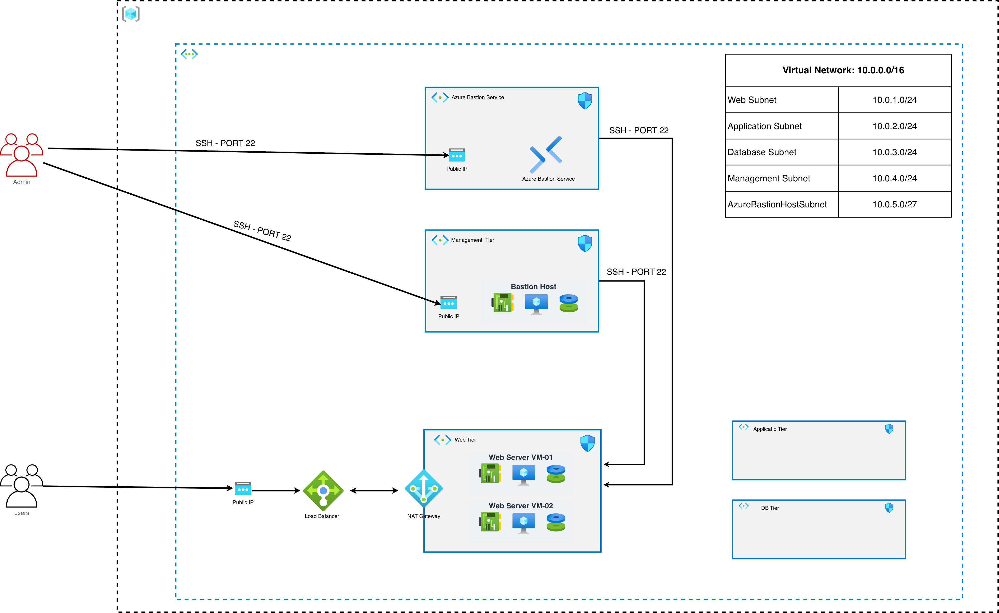
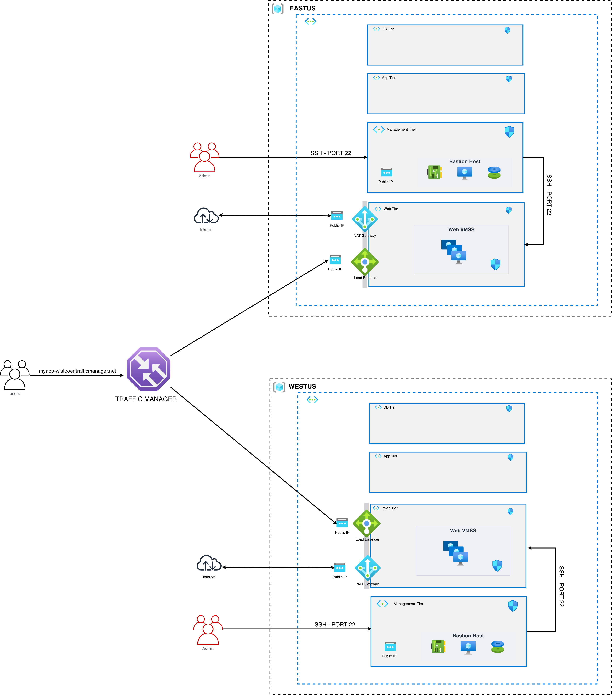
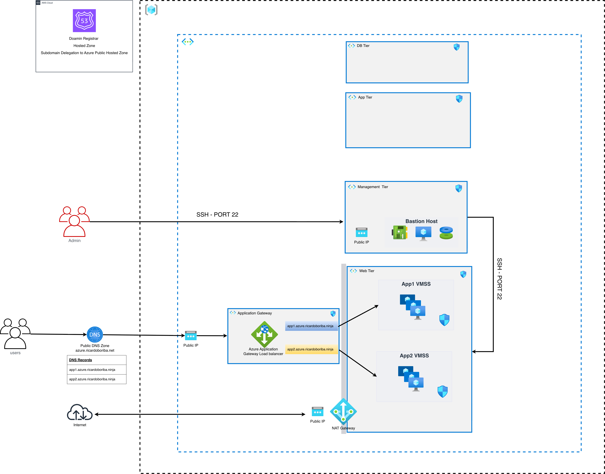
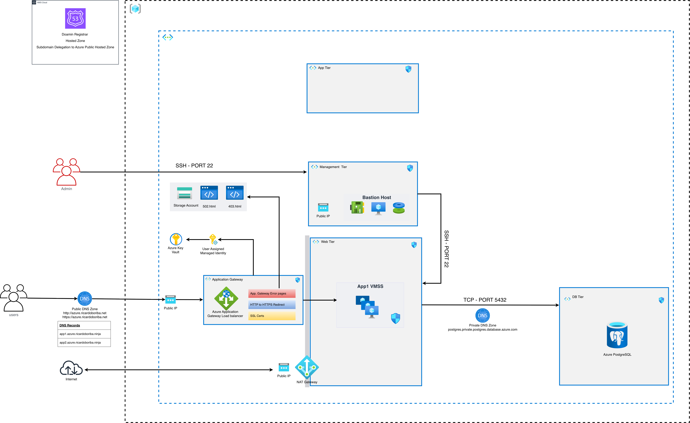

# Azure Architecture Solutions with Terraform

This repository contains a progressive set of Azure architecture projects implemented with Terraform. Each project is self-contained and adds services or architectural patterns to the previous solution, from a highly available Linux web tier to a private PostgreSQL-backed application delivered through Application Gateway.

The projects are independent Terraform root modules. Deploy them from their own directories rather than running Terraform from the repository root.

## Projects

| Project                                          | Architecture focus                                                                                                                | Documentation                                                          |
| ------------------------------------------------ | --------------------------------------------------------------------------------------------------------------------------------- | ---------------------------------------------------------------------- |
| 00 - Project 01 - Linux VM                       | Linux web VMs, Standard Load Balancer, NAT Gateway, Bastion, and network segmentation                                             | [Project README](00-Project01-LinuxVM/README.md)                       |
| 01 - Project 02 - Web VMSS                       | Web and application VMSS tiers, public and internal load balancers, storage, private DNS, public DNS, and AWS Route 53 delegation | [Project README](01-Project02-WebVMSS/README.md)                       |
| 02 - Project 03 - Traffic Manager                | Multi-region web deployments in East US and West US with Azure Traffic Manager                                                    | [Project README](02-Project03-TrafficManager/README.md)                |
| 03 - Project 04 - Application Gateway            | Layer 7 routing with Azure Application Gateway                                                                                    | [Project README](03-Project04-ApplicationGateway/README.md)            |
| 04 - Project 05 - Application Gateway SSL        | Application Gateway HTTP-to-HTTPS redirect, Key Vault certificate, managed identity, and custom error pages                       | [Project README](04-Project05-ApplicationGateway-SSL/README.md)        |
| 05 - Project 06 - Application Gateway PostgreSQL | Application Gateway, two-instance VMSS, private PostgreSQL Flexible Server, private DNS, and custom error pages                   | [Project README](05-Project06-ApplicationGateway-PostgreSQL/README.md) |

## Architecture Progression

The projects build architectural capabilities in stages:

1. **Project 01** establishes the virtual network, segmented subnets, Linux web servers, load balancing, outbound NAT, and secure administration.
2. **Project 02** introduces independently managed web and application VMSS tiers, internal service discovery, cloud storage, and hybrid Azure/AWS DNS.
3. **Project 03** extends the design across Azure regions and routes users to regional endpoints with Traffic Manager.
4. **Project 04** adds HTTP-aware routing and Layer 7 application delivery with Application Gateway.
5. **Project 05** adds HTTP-to-HTTPS redirection, TLS termination with a Key Vault certificate, a user-assigned managed identity, and custom gateway error pages. It does not deploy a WAF.
6. **Project 06** adds a private PostgreSQL Flexible Server, delegated database subnet, VNet-linked private DNS, and VMSS-to-database connectivity. Its directory name retains the historical `MySQL` label, but the Terraform implementation uses PostgreSQL.

## Prerequisites

Install the following tools on the machine used to deploy the infrastructure:

- [Terraform](https://developer.hashicorp.com/terraform/install), version `1.0` or later. The projects use the AzureRM provider version `5.x` or later; some projects also use AWS, Random, and Null providers.
- [Azure CLI](https://learn.microsoft.com/cli/azure/install-azure-cli), authenticated to an Azure subscription with permission to create and manage the resources in the selected resource group.
- [AWS CLI](https://docs.aws.amazon.com/cli/latest/userguide/getting-started-install.html) and credentials when deploying a project that uses the AWS provider, especially Project 02.
- An SSH key pair. The Terraform configurations reference `~/.ssh/sre-keys.pub`, so create that key or update the relevant Terraform files to use another public key.
- Either an existing Azure resource group, or permission to create a new resource group for the selected project.
- An Azure subscription with sufficient quota for virtual machines, VM scale sets, public IP addresses, load balancers, and the other services used by the selected project.

Check the installed tools:

```bash
terraform version
az version
aws --version
```

Authenticate before running Terraform:

```bash
az login
az account set --subscription "<AZURE_SUBSCRIPTION_ID_OR_NAME>"
aws configure
```

Confirm the SSH public key expected by the configurations exists:

```bash
test -f ~/.ssh/sre-keys.pub
```

For Project 02, also confirm that the AWS account contains the parent Route 53 public hosted zone configured in `terraform.tfvars` and that the AWS identity can read the zone and create the NS delegation record. Azure DNS hosts the delegated `azure.<domain>` subdomain.

## Configuration Before Deployment

Review the `terraform.tfvars` file in the project directory you intend to deploy. At minimum, verify:

- The resource-group deployment mode: existing resource group by default, or the new-resource-group procedure below.
- The Azure region and CIDR ranges fit the target environment.
- VM sizes and instance counts fit the subscription quota and budget.
- Domain, certificate, database, and storage values are appropriate for the project.
- AWS Route 53 access and the parent domain are configured for Project 02.
- Project 06 PostgreSQL values, including `postgres_db_name`, `postgres_db_username`, and `postgres_db_password`, are supplied securely.

Do not commit passwords, private keys, access keys, or other secrets. Prefer environment variables, a secret manager, or an untracked `.tfvars` file for sensitive values. Terraform state can contain sensitive resource attributes; protect the configured remote backend and avoid publishing state files.

## Deploy a Project

Run the following workflow from the selected project directory. The commands below use Project 01 as an example; replace the directory with the project you want to deploy.

```bash
cd 00-Project01-LinuxVM
terraform init
terraform fmt -check
terraform validate
terraform plan -out=tfplan
terraform apply tfplan
```

For an initial deployment where formatting changes are acceptable, run `terraform fmt` instead of `terraform fmt -check`. Review the plan carefully before applying it, especially when the project points to an existing resource group.

After deployment, inspect the values exposed by the project:

```bash
terraform output
terraform output -json > terraform-outputs.json
```

Use the project README for the architecture-specific validation steps, expected endpoints, DNS names, and access paths.

## Project-Specific Deployment Notes

### Project 01 - Linux VM

This is the foundational single-region deployment. It uses Azure networking, Linux web VMs, a public Standard Load Balancer, NAT Gateway, Bastion resources, and NSGs. Validate the load balancer endpoint and connect to private workload VMs through the documented administration path.



### Project 02 - Web VMSS

This project uses both Azure and AWS providers:

```bash
cd 01-Project02-WebVMSS
terraform init
terraform fmt -check
terraform validate
terraform plan -out=tfplan
terraform apply tfplan
```

The deployment creates a Web Tier VMSS and an Application Tier VMSS, public and internal load balancers, an Azure Storage Account and private container, private DNS, Azure public DNS, and an AWS Route 53 NS delegation record. Ensure the AWS backend bucket and Route 53 parent zone are available before `terraform init` and `terraform apply`.


### Project 03 - Traffic Manager

This project contains a root configuration and separate regional modules under `project-eastus/` and `project-westus/`. Read its README and inspect the root and regional `terraform.tfvars` files before planning so that both regions and their endpoint configuration are understood.



### Project 04 - Application Gateway

This project provides HTTP host-based routing for two independent two-instance VMSS backends. It does not configure TLS, HTTPS, WAF, or a managed Azure Bastion service. Azure Public DNS and AWS Route 53 delegation are included.



### Project 05 - Application Gateway SSL

This project provides HTTP-to-HTTPS redirection, TLS termination using a certificate imported into Azure Key Vault, a user-assigned managed identity with Key Vault secret access, Azure Public DNS, AWS Route 53 delegation, and custom `403.html` and `502.html` pages hosted in Azure Storage. It has one VMSS resource with two instances and no WAF deployment.


### Project 06 - Application Gateway PostgreSQL

Despite its historical directory name, this project uses Azure Database for PostgreSQL Flexible Server, not MySQL. It has one two-instance VMSS, a PostgreSQL-delegated database subnet, a VNet-linked private DNS zone, private-only database access, Key Vault certificate integration, Azure Public DNS, AWS Route 53 delegation, and a Linux management VM. Review certificate paths, DNS values, PostgreSQL credentials, and other secret inputs before planning. Do not place certificate private keys or database passwords in version control.



## Deploy with a New Resource Group

The Terraform projects currently look up an existing resource group with a data source. Their `azurerm_resource_group` resource blocks are commented out. To deploy a project into a new resource group, make the following small change in that project's Terraform root before running `terraform plan`:

1. Open the project's `main.tf` and uncomment its `azurerm_resource_group "rg"` block near the top of the file.
2. Open the project's `helpers.tf` and comment out the `data "azurerm_resource_group" "rg"` block. The resource and data source cannot both manage the same `rg` reference.
3. Set the resource group name and location in the resource block. Use the location variable already defined by that project:

```hcl
resource "azurerm_resource_group" "rg" {
	name     = "<NEW_RESOURCE_GROUP_NAME>"
	location = var.resource_group_location # Projects 00-02
	# location = var.resource_location        # Projects 03-06
	tags     = local.common_tags
}
```

4. In `terraform.tfvars`, remove or leave unused `existing_resource_group_name`, and set the project's location variable where applicable. Project 02 also requires AWS credentials and a Route 53 parent zone because it manages DNS delegation.
5. Run formatting, validation, and a plan before applying:

```bash
terraform fmt
terraform validate
terraform plan -out=tfplan
terraform apply tfplan
```

The change must be made in every Terraform root that will be deployed. Project 03 has a root configuration plus `project-eastus/` and `project-westus/`; each regional root has its own resource-group lookup and must be switched independently if both regions use newly created resource groups. Keep resource-group names unique within the subscription and verify the selected region supports the required VM, Application Gateway, PostgreSQL, and networking SKUs.

To return to the repository's default existing-resource-group mode, restore the `data "azurerm_resource_group" "rg"` block in `helpers.tf`, comment out the resource block in `main.tf`, and set `existing_resource_group_name` in `terraform.tfvars`.

## Destroy a Project

Destroy only from the same project directory used for deployment, and review the plan carefully because this removes Azure resources:

```bash
cd 00-Project01-LinuxVM
terraform plan -destroy -out=destroy.tfplan
terraform apply destroy.tfplan
```

For Projects 02, 03, 04, 05, and 06, destroying the Terraform configuration can remove DNS delegation records managed by the AWS provider. Preserve any shared resources, parent DNS zones, or records that are not owned exclusively by the project before approving the destroy plan. When using a newly created resource group, verify the destroy plan before allowing Terraform to remove the group and all resources it contains.

## Troubleshooting

- **Authentication errors:** rerun `az login`, select the intended subscription, and verify AWS credentials when applicable.
- **Backend initialization errors:** confirm access to the configured remote state backend and run `terraform init -reconfigure` only when you intentionally need to reconfigure it.
- **Quota or SKU errors:** reduce VM counts or sizes, choose an available region/SKU, or request quota before applying again.
- **SSH key errors:** create `~/.ssh/sre-keys.pub` or update the project configuration to reference the correct public key.
- **DNS errors:** verify domain ownership, Route 53 permissions, Azure DNS nameservers, and delegation records before testing public names.
- **Plan drift:** inspect the plan and Azure resources before using `-refresh-only`; do not discard state or manually remove resources without understanding the resulting drift.
